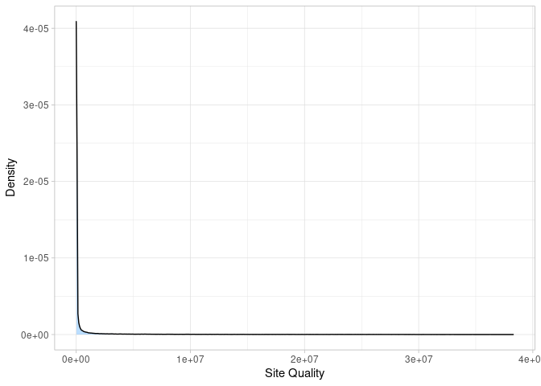

Creating the data set
================
Margaux Lefebvre
2022-10-10

This repository is for this paper: (citation)

All the data are available here:

The languages used are mainly bash and R.

The main filters and steps to create the dataset are described here :


# Primary filters for the data from *P. falciparum* Community Project conducted by MalariaGen: Blue

The data from the *P. falciparum* Community Project conducted by
MalariaGen are described by [Pearson *et al.*
(2019)](http://dx.doi.org/10.1101/824730) and can be download from [the
Wellcome Trust Sanger Institute public ftp
site](ftp://ngs.sanger.ac.uk/production/malaria/pfcommunityproject/CatalogueOfVariations_v4.0/).
The data are available already in VCF and separated by chromosome.

The meta-information for the data are in
[Pf_6\_samples.txt](Pf_6_samples.txt). We kept only the samples that
pass the Quality Check (“QC pass” as TRUE) as described by [Pearson *et
al.* (2019)](http://dx.doi.org/10.1101/824730) :
`-S quality_samples.txt` with quality_samples.txt as a list of all the
samples kept. We also filtered the dataset to only keep high quality
bi-allelic SNPs
(`--include 'FILTER="PASS" && N_ALT=1 && TYPE="snp" && VQSLOD>6.0'`).

``` bash
ARR_CHR=(01 02 03 04 05 06 07 08 09 10 11 12 13 14)
for CHR in ${ARR_CHR[@]}
do
bcftools view Pf_60_public_Pf3D7_${CHR}_v3.final.vcf.gz -S quality_samples.txt \
--include 'FILTER="PASS" && N_ALT=1 && TYPE="snp" && VQSLOD>6.0' \
--output-type z --output-file Sanger_Chr_${CHR}.vcf.gz
tabix Sanger_Chr_${CHR}.vcf.gz
done
```

# Mapping and calling for the added data (Brazil, Haiti and French Guiana): Yellow

The data are publicly available on NCBI’s Sequencing Read Archive under
BioProject accession:

-   PRJNA312679 (Brazil)
-   PRJNA242163 (French Guiana)
-   PRJNA603776 (Haiti)

`$downId` is the variable for the name of the sample.

First, we cleaned the bam (remove the adapters, remove reads with low
quality score and remove reads shorter than 25 bp) :

``` bash
cutadapt -a AGATCGGAAGAGCACACGTCTGAA -A AGATCGGAAGAGCGTCGTGTAGGGAAAGAGTGTAGATCTCGGTGGTCGCCGTATCATT -q 30 -m 25 --max-n 0 -o $downId.R1.fastq.gz -p $downId.R2.fastq.gz $downId.raw.1.fastq.gz $downId.raw.2.fastq.gz
```

We mapped the sequence on the *P. falciparum* reference genome 3D7 (we
only kept the reads that mapped `samtools view -F 4 -b -`)

``` bash
bwa mem -t 1 PlasmoDB-55_PmalariaeUG01_Genome.fasta $downId.R1.fastq.gz $downId.R2.fastq.gz | samtools view -F 4 -b - | samtools sort - -o $downId.mapPF.sort.bam
samtools index $downId.mapPM.sort.bam
```

We processed the bam file:

``` bash
# Mark the duplicates
java -jar /usr/local/picard-tools-2.5.0/picard.jar MarkDuplicates INPUT=$downId.mapPF.sort.bam OUTPUT=$downId.map.sort.dedup.bam METRICS_FILE=metrics.txt
samtools index $downId.map.sort.dedup.bam

# Add groups informations
java -jar /usr/local/picard-tools-2.5.0/picard.jar AddOrReplaceReadGroups I=$downId.map.sort.dedup.bam O=$downId.map.sort.dedup.rg.bam LB=LIB-$downId PL=ILLUMINA PU=H0164ALXX140820:2:1101 SM=$downId
samtools index $downId.map.sort.dedup.rg.bam

# Splits reads that contain Ns in their cigar string
java -jar ~/softs/GenomeAnalysisTK-3.8-0-ge9d806836/GenomeAnalysisTK.jar -T SplitNCigarReads -R PlasmoDB-57_Pfalciparum3D7_Genome.fasta -I $downId.map.sort.dedup.rg.bam -o $downId.map.sort.dedup.rg.rq.bam -rf ReassignOneMappingQuality -RMQF 255 -RMQT 60 -U ALLOW_N_CIGAR_READS
samtools index $downId.map.sort.dedup.rg.rq.bam
```

Alignment and call of the nucleotides:

``` bash
# Identify and create a target intervals list (indels)
java -jar ~/softs/GenomeAnalysisTK-3.8-0-ge9d806836/GenomeAnalysisTK.jar -T RealignerTargetCreator -R PlasmoDB-57_Pfalciparum3D7_Genome.fasta -I $downId.map.sort.dedup.rg.rq.bam -o $downId.realignertargetcreator.intervals
# Local realignment for the target intervals
java -Djava -jar ~/softs/GenomeAnalysisTK-3.8-0-ge9d806836/GenomeAnalysisTK.jar -T IndelRealigner -R PlasmoDB-57_Pfalciparum3D7_Genome.fasta -targetIntervals $downId.realignertargetcreator.intervals -I $downId.map.sort.dedup.rg.rq.bam -o $downId.map.sort.dedup.indelrealigner.bam
# Call of all the nucleotides as diploid
java -jar ~/softs/GenomeAnalysisTK-3.8-0-ge9d806836/GenomeAnalysisTK.jar -T HaplotypeCaller -R PlasmoDB-57_Pfalciparum3D7_Genome.fasta -I $downId.bwa.gatk.sort.bam --genotyping_mode DISCOVERY -stand_call_conf 10 -o $downId.ploidy2.raw_variants.snp.indel.g.vcf -ERC GVCF --sample_ploidy 2
bgzip ${downId}.ploidy2.raw_variants.snp.indel.g.vcf
tabix ${downId}.ploidy2.raw_variants.snp.indel.g.vcf.gz
```

Subsequently, the VCFs were combined and separated by chromosome
(`Chr_Sth_Am_${CHR}.vcf.gz`).

# Merge & final filters for the whole dataset: Green

## Merge the data

``` bash
ARR_CHR=(01 02 03 04 05 06 07 08 09 10 11 12 13 14)
for CHR in ${ARR_CHR[@]}
  # Extract the positions of the core genome
  bcftools query -f '%CHROM\t%POS\n' Chr_Sanger_${CHR}.vcf.gz > Chr_${CHR}_SNP.txt
  # Merge the two datasets
  bcftools merge -m id -i AC:sum,AN:sum,DP:min Sanger_Chr_${CHR}.vcf.gz Chr_Sth_Am_${CHR}.vcf.gz -O z -o CHR_${CHR}.vcf.gz
  tabix CHR_${CHR}.vcf.gz
  # Remove part that are not the core genome
  bcftools view CHR_${CHR}.vcf.gz -R Chr_${CHR}_SNP.txt -O z -o Chr_${CHR}.vcf.gz
  tabix Chr_${CHR}.vcf.gz
done
```

To filter the whole genome correctly, we merge all the chromosomes
together (picard tools `GatherVcfs`) : `all_genome.vcf.gz`.

## Analysis on the VCF

``` bash
VCF=all_genome.vcf.gz
OUT=info_pfalci

bcftools view -H $VCF | wc -l
vcftools --gzvcf $VCF --freq2 --out $OUT --max-alleles 2
vcftools --gzvcf $VCF --depth --out $OUT
vcftools --gzvcf $VCF --site-mean-depth --out $OUT
vcftools --gzvcf $VCF --site-quality --out $OUT 
vcftools --gzvcf $VCF --missing-indv --out $OUT 
vcftools --gzvcf $VCF --missing-site --out $OUT 
```

### Variant quality

The first metric we will look at is the (Phred encoded) site quality.
This is a measure of how much confidence we have in our variant calls.

``` r
var_qual <- read_delim("./Data/info_pfalci.lqual", delim = "\t",
           col_names = c("chr", "pos", "qual"), skip = 1, show_col_types = FALSE)
a <- ggplot(var_qual, aes(qual)) + geom_density(fill = "dodgerblue1", colour = "black", alpha = 0.3)
a + theme_light()+xlab("Site Quality")+ylab("Density")
```

<!-- -->

The minimum Phred score is 44.

### Variant mean depth

``` r
var_depth <- read_delim("./Data/info_pfalci.ldepth.mean", delim = "\t",
           col_names = c("chr", "pos", "mean_depth", "var_depth"), skip = 1, show_col_types = FALSE)
a <- ggplot(var_depth, aes(mean_depth)) + geom_density(fill = "dodgerblue1", colour = "black", alpha = 0.3)
a + theme_light() +xlab("Variant mean depth")+ylab("Density")
```

<!-- -->

The minimum mean depth is 8.624.

### Mean depth per individual

``` r
ind_depth <- read_delim("./Data/info_pfalci.idepth", delim = "\t",
                        col_names = c("ind", "nsites", "depth"), skip = 1, show_col_types = FALSE)
a <- ggplot(ind_depth, aes(depth)) + geom_histogram(fill = "dodgerblue1", colour = "black", alpha = 0.3)
a + theme_light() +xlab("Mean depth/individual")+ylab("Density")
```

<!-- -->

Some samples have low mean coverage (\~ 5X).

### Proportion of missing data per individual

``` r
ind_miss  <- read_delim("./Data/info_pfalci.imiss", delim = "\t",
                        col_names = c("ind", "ndata", "nfiltered", "nmiss", "fmiss"), skip = 1, show_col_types = FALSE)
a <- ggplot(ind_miss, aes(fmiss)) + geom_histogram(fill = "dodgerblue1", colour = "black", alpha = 0.3)
a + theme_light()+xlab("Proportion of missing data/individual")+ylab("Density")
```

<!-- -->

Remove individuals with more than 20% of data missing (we keep 6,047
samples).

### Variant missingness

``` r
var_miss <- read_delim("./Data/info_pfalci.lmiss", delim = "\t",
                       col_names = c("chr", "pos", "nchr", "nfiltered", "nmiss", "fmiss"), skip = 1, show_col_types = FALSE)
a <- ggplot(var_miss, aes(fmiss)) + geom_density(fill = "dodgerblue1", colour = "black", alpha = 0.3)
a + theme_light()+xlab("Proportion of missing data/variant")+ylab("Density")
```

<!-- -->

### Minimum Allele Frenquency (MAF)

``` r
var_freq <- read_delim("./Data/info_pfalci.frq", delim = "\t",
                       col_names = c("chr", "pos", "nalleles", "nchr", "a1", "a2"), skip = 1, show_col_types = FALSE)
var_freq$maf <- var_freq %>% select(a1, a2) %>% apply(1, function(z) min(z))
a <- ggplot(var_freq, aes(maf)) + geom_density(fill = "dodgerblue1", colour = "black", alpha = 0.3)
a + theme_light()+xlab("MAF")+ylab("Density")
```

<!-- -->

To avoid sequencing errors, we remove sites that have a MAF \< 1/number
of samples (1/6047).

### Applying filters to the VCF

``` bash
VCF_IN=data_total/all_genome.vcf.gz
VCF_OUT=data_total/all_genome_filtered.vcf.gz

# set filters
MAF=0.000165371
MISS=0.9
MIN_DEPTH=15

vcftools --gzvcf $VCF_IN --min-alleles 2 --max-alleles 2 --remove miss_samples.txt \
--remove-indels --maf $MAF --minDP $MIN_DEPTH --max-missing $MISS --min-meanDP $MIN_DEPTH \
--recode --stdout | gzip -c > $VCF_OUT
```

What have we done here?

-   `--remove-indels` - remove all indels (SNPs only).
-   `--maf`- set minor allele frequency - here 1/number of samples.
-   `--max-missing` - set minimum missing data for sites. A little
    counter intuitive - 0 is totally missing, 1 is none missing. Here
    0.9 means we will tolerate 10% missing data.
-   `--minDP` - the minimum depth allowed for a genotype - any
    individual failing this threshold is marked as having a missing
    genotype.
-   `--min-alleles` + `--max-alleles` - to keep only bi-allelic SNPs.
-   `--min-meanDP` - the minimum mean depth for a site.
-   `--remove miss_samples.txt` - remove all the samples with more than
    20% of missing data (see above).

**Finally, 78,036 SNPs and 6,039 samples are remaining.**

## Filter multi-clonal infections

> The *F<sub>WS</sub>* metric estimates the heterozygosity of parasites
> (HW) within an individual relative to the heterozygosity within a
> parasite population (HS) using the read count of alleles.
> *F<sub>WS</sub>* metric calculation for each sample was performed
> using the following equation: ***F<sub>WS</sub>*=1− HW/HS** where HW
> refers to the allele frequency of each unique allele found at specific
> loci of the parasite sequences within the individual, and HS refers to
> the corresponding allele frequencies of those unique alleles within
> the population. *F<sub>WS</sub>* ranges from 0 to 1; a low
> *F<sub>WS</sub>* value indicates low inbreeding rates within the
> parasite population and thus high within-host diversity relative to
> the population. An *F<sub>WS</sub>* threshold ≥ 0.95 indicates samples
> with clonal (single strain) infections, while samples with an
> *F<sub>WS</sub>* \< 0.95 are considered highly likely to come from
> mixed strain infections, indicating within-host diversity.

Source : [Amegashie *et al.*
(2020)](https://doi.org/10.1186/s12936-020-03510-3).

The *F<sub>WS</sub>* must be calculated by population. So we split up
the VCF by country : `all_genome_${country_name}.vcf.gz`

``` bash
while read country_name
do
echo "Sample  Fws Standard_errors nb_sites" > ${country_name}.txt
vcfdo wsaf -i all_genome_${country_name}.vcf.gz | vcfdo fws >> ${country_name}.txt
done < country_list.txt
```

Graph:

``` r
fws_all <-
    list.files(path="./Data/FWS/",
               pattern = "*.txt", 
               full.names = T) %>% 
    map_dfr(~read_table2(.))

# Add meta-informations
Samples_data<-read_delim("./Data/qual_miss.txt", 
     delim = "\t", escape_double = FALSE, 
    trim_ws = TRUE, show_col_types = FALSE)
fws_all<-inner_join(fws_all, Samples_data)
fws_all <- fws_all[-which(fws_all$Country == "Mozambique"), ] # Remove Mozambique

# Order the dataframe
fws_all$Country<-factor(fws_all$Country, levels=c("Congo_DR", "Burkina_Faso", "Cameroon" ,"Mauritania","Guinea","Gambia","Ghana", "Mali","Nigeria","Ivory_Coast" ,"Benin", "Senegal","Kenya","Tanzania","Malawi", "Madagascar", "Uganda", "Ethiopia", "Bangladesh", "Thailand","Myanmar","Cambodia","Viet_Nam", "Laos", "Indonesia", "Papua_New_Guinea", "Peru","Colombia","Haiti", "Brazil","French_Guiana"))

fws_all$Population<-factor(fws_all$Population, levels = c("SAM","WAF","CAF","EAF","SAS","WSEA","ESEA","OCE"))
fws_na<-subset(fws_all, is.na(fws_all$Country))

# Plot
q <- ggplot(fws_all, aes(x=Fws, y=Country, fill=Country, color=Country))+
  geom_point(width=0.2, alpha=1, outlier.size=1, outlier.alpha = 1)+
  ylab("")+
  xlab("Fws")+
  scale_fill_manual(values = c("#ED820E",
"#986868","#7C0A02","#B80F0A","#8D021F","#CA3433", "#FF2800", "#D21F3C", "#A45A52","#CD5C5C", "#B22222","#ED2939",
"#F8DE7E","#E4CD05","#FED300","#FEDC56","#FEE12B","#fffafa",
"#710193", "#89CFF0","#00B7EB","#0093AF","#0F4D92","#0047AB","#FDAB9F","#FC94AF",
"#90EE90","#9ACD32","#808000","#3CB371","#006400"))+
  scale_color_manual(values = c("#ED820E",
"#986868","#7C0A02","#B80F0A","#8D021F","#CA3433", "#FF2800", "#D21F3C", "#A45A52","#CD5C5C", "#B22222","#ED2939",
"#F8DE7E","#E4CD05","#FED300","#FEDC56","#FEE12B","#E1C16E",
"#710193", "#89CFF0","#00B7EB","#0093AF","#0F4D92","#0047AB","#FDAB9F","#FC94AF",
"#90EE90","#9ACD32","#808000","#3CB371","#006400"))+theme_bw()+ 
  theme(
    panel.spacing.y = unit(0.1, "lines"),
    legend.position = "none"
  )+facet_grid(Population~., scales = "free_y", space='free_y')
q+geom_vline(xintercept = 0.95, linetype="dotted")
```

<!-- -->

So, we removed the only individual from Mozambique (to avoid biases from
a population including only one individual), and all the samples that
showed evidence of multi-clonal infection (*F<sub>WS</sub>* \< 0.95). We
keep 3,697 individuals.

## Filter the related strains

> Highly related samples and clones can generate spurious signals of
> population structure, bias estimators of population genetic variation,
> and violate the assumptions of the model-based population genetic
> approaches ([Wang 2018](https://doi.org/10.1111/1755-0998.12708)). The
> relatedness between haploid genotype pairs was measured by estimating
> the pairwise fraction of the genome identical by descent (*IBD*)
> between strains within populations.

The *IBD* must be calculated by population. So we split up the VCF by
country : `all_genome_${country_name}.vcf.gz`

We used hmmIBD that as a specific format as an input, with only haploid
information. For the sites that was heterozygote, they were marked as
missing data.

``` bash
while read country_name
do
# Transform in hmmIBD format
bcftools annotate -x INFO,^FORMAT/GT all_genome_${country_name}.vcf.gz |grep -v "##" |cut -d$'\t' -f1-2,10- > temp0

sed 's/0\/0/0/g' temp0 > temp1
sed 's/1\/1/1/g' temp1 > temp2
sed 's/1\/0/-1/g' temp2 > temp3
sed 's/0\/1/-1/g' temp3 > temp4
sed 's/0\/1/-1/g' temp4 > temp5
sed 's/.\/./-1/g' temp5 > temp6
sed 's/Pf3D7__\([0-9][0-9]*\)_v3/\1/g' temp6 > format_hmm.pf

# Running hmmIBD
hmmIBD -i format_hmm.pf -o IBD_${country_name}
done < ./country/country_list.txt
```

Graph:

``` r
IBD_all <-
    list.files(path="./Data/IBD/",
               pattern = "*.hmm_fract.txt", 
               full.names = T) %>% 
    map_dfr(~read_table(.), show_col_types=F)

# Add meta-informations
Samples_data<-read_delim("./Data/qual_miss.txt", 
     delim = "\t", show_col_types = FALSE)
Samples_data$sample1<-Samples_data$Sample
IBD_all<-inner_join(IBD_all, Samples_data)

IBD_all$Country<-factor(IBD_all$Country, levels=c("Congo_DR", "Burkina_Faso", "Cameroon" ,"Mauritania","Guinea","Gambia","Ghana", "Mali","Nigeria","Ivory_Coast" ,"Benin", "Senegal","Kenya","Tanzania","Malawi", "Mozambique", "Madagascar", "Uganda", "Ethiopia", "Bangladesh", "Thailand","Myanmar","Cambodia","Viet_Nam", "Laos", "Indonesia", "Papua_New_Guinea", "Peru","Colombia","Haiti", "Brazil","French_Guiana"))

IBD_all$Population<-factor(IBD_all$Population, levels = c("SAM","WAF","CAF","EAF","SAS","WSEA","ESEA","OCE"))
IBD_na<-subset(IBD_all, is.na(IBD_all$Country))

q <- ggplot(IBD_all, aes(x=fract_sites_IBD, y=Country, fill=Country,  color=Country))+
  geom_point(alpha=0.5)+
  ylab("")+
  xlab("IBD")+
  scale_color_manual(values = c("#ED820E",
"#986868","#7C0A02","#B80F0A","#8D021F","#CA3433", "#FF2800", "#D21F3C", "#A45A52","#CD5C5C", "#B22222","#ED2939",
"#F8DE7E","#E4CD05","#FED300","#FEDC56","#FEE12B","#E1C16E",
"#710193", "#89CFF0","#00B7EB","#0093AF","#0F4D92","#0047AB","#FDAB9F","#FC94AF",
"#90EE90","#9ACD32","#808000","#3CB371","#006400"))+
  scale_fill_manual(values = c("#ED820E",
"#986868","#7C0A02","#B80F0A","#8D021F","#CA3433", "#FF2800", "#D21F3C", "#A45A52","#CD5C5C", "#B22222","#ED2939",
"#F8DE7E","#E4CD05","#FED300","#FEDC56","#FEE12B","#E1C16E",
"#710193", "#89CFF0","#00B7EB","#0093AF","#0F4D92","#0047AB","#FDAB9F","#FC94AF",
"#90EE90","#9ACD32","#808000","#3CB371","#006400"))+theme_bw()+ 
  theme(
    panel.spacing.y = unit(0.1, "lines"),
    legend.position = "none"
  )+facet_grid(Population~., scales = "free_y", space='free_y')
q+geom_vline(xintercept = 0.5, linetype="dotted")
```

<!-- -->

Isolate pairs that shared \>50% of *IBD* are considered highly related.
In each family of related samples, only the strain with the lowest
amount of missing data was retained:

``` r
total_list<-unique(c(IBD_all$sample1,IBD_all$sample2)) # List of all the samples
# Only keep pair of individuals with IBD>0.5
fam_IBD<-subset(IBD_all, IBD_all$fract_sites_IBD>0.5)

#Assign family factor by individuals
clst = data.frame(ind = c(as.character(fam_IBD$sample1[1]), as.character(fam_IBD$sample2[1])), grp = c(1,1)) # initialize data.frame
clst
for(i in 2:dim(fam_IBD)[1]){
  if(length(which(as.character(fam_IBD$sample1[i])==clst$ind))>0){
    tmp = data.frame(ind = c(as.character(fam_IBD$sample1[i]), as.character(fam_IBD$sample2[i])), grp = c(clst$grp[which(as.character(fam_IBD$sample1[i])==clst$ind)],clst$grp[which(as.character(fam_IBD$sample1[i])==clst$ind)]))
    clst = rbind(clst, tmp)
  } else if(length(which(as.character(fam_IBD$sample2[i])==clst$ind))>0){
    tmp = data.frame(ind = c(as.character(fam_IBD$sample1[i]), as.character(fam_IBD$sample2[i])), grp = c(clst$grp[which(as.character(fam_IBD$sample2[i])==clst$ind)],clst$grp[which(as.character(fam_IBD$sample2[i])==clst$ind)]))
    clst = rbind(clst, tmp)
  } else {
    tmp = data.frame(ind = c(as.character(fam_IBD$sample1[i]), as.character(fam_IBD$sample2[i])), grp = c(max(clst$grp)+1,max(clst$grp)+1))
    clst = rbind(clst, tmp)
  }
  clst = unique(clst)
}

# import the information of missing data (from vcftools, see above)
ind_miss  <- read_delim("./Data/info_pfalci.imiss", delim = "\t",
                        col_names = c("ind", "ndata", "nfiltered", "nmiss", "fmiss"), skip = 1, show_col_types = FALSE)
data_fam<-inner_join(clst, ind_miss)

#keep the individual in each family with the less missing data
unrelated<-data_fam %>% 
    group_by(grp) %>% 
    slice(which.min(fmiss))
```

**In the final dataset, we have 2,635 individuals for 78,036 SNPs.**

# LD-pruning, MAF filtering for some analysis

Some analysis assume a dataset with unlinked variants, so we pruned the
SNPs (PCA, ADMIXTURE, ADMIXTOOLS2 & TreeMix). To keep only independent
SNPs, we have to prune the genome. Here, in a windows of 50 SNPs and a
step of 10, we remove SNPs linked above 10%. We also set a MAF filter at
0.1% to remove the doubletons for PCA and ADMIXTURE: adding to plink
command `--geno --maf 0.001 --mind`.

``` bash
plink2 --vcf all_genome_samples_filter.vcf.gz --double-id --allow-extra-chr \
--set-missing-var-ids @:# \
--indep-pairwise 50 10 0.1 --out Prune

sed -e ' s/:/\t/g' Prune.prune.in > bcft_Prune.prune.in

bcftools view all_genome_samples_filter.vcf.gz -R bcft_Prune.prune.in -O z -o all_genome_pruned.vcf.gz
```

The filtered dataset contains 41,921 SNPs with 2,434 individuals.

# *Plasmodium praefalciparum* as an outgroup

For some analysis, we add a outgroup with 3 *P. praefalciparum* (aka
*Plasmodium sp. gorilla clade G1*) samples that come from [Otto *et al.*
(2018)](https://doi.org/10.1038%2Fs41564-018-0162-2). The samples are
accessible from the European Nucleotide Archive under sample accessions
SAMEA2464702, SAMEA2073285, and SAMEA2493921.

The samples were treated as the ones added (Brazil, Haiti and French
Guiana).

We polarized the alleles with a homemade Python script (personal
communication from a colleague), with at least no missing data in one
*P. praefalciparum* sample.

The polarized dataset contains 31,892 SNPs with 2,638 samples.

# Softwares and version

**Softwares used:**

-   bcftools 1.10.2
-   cutadapt 1.18
-   bwa
-   samtools 1.10
-   picard tools 2.5.0
-   GATK 3.8.0
-   java jre 1.8.111 (for Picard tools and GATK)
-   tabix 0.2.6
-   vcftools 0.1.16
-   vcfdo ([accessed July 2022](https://github.com/IDEELResearch/vcfdo))
-   hmmIBD v2.0.4
-   PLINK 2
-   Python 3.9.5

<!-- -->

    ## R version 4.2.1 (2022-06-23)
    ## Platform: x86_64-pc-linux-gnu (64-bit)
    ## Running under: Ubuntu 22.04.1 LTS
    ## 
    ## Matrix products: default
    ## BLAS:   /usr/lib/x86_64-linux-gnu/blas/libblas.so.3.10.0
    ## LAPACK: /usr/lib/x86_64-linux-gnu/lapack/liblapack.so.3.10.0
    ## 
    ## locale:
    ##  [1] LC_CTYPE=fr_FR.UTF-8       LC_NUMERIC=C              
    ##  [3] LC_TIME=fr_FR.UTF-8        LC_COLLATE=fr_FR.UTF-8    
    ##  [5] LC_MONETARY=fr_FR.UTF-8    LC_MESSAGES=fr_FR.UTF-8   
    ##  [7] LC_PAPER=fr_FR.UTF-8       LC_NAME=C                 
    ##  [9] LC_ADDRESS=C               LC_TELEPHONE=C            
    ## [11] LC_MEASUREMENT=fr_FR.UTF-8 LC_IDENTIFICATION=C       
    ## 
    ## attached base packages:
    ## [1] stats     graphics  grDevices utils     datasets  methods   base     
    ## 
    ## other attached packages:
    ## [1] forcats_0.5.2   stringr_1.4.1   dplyr_1.0.9     purrr_0.3.4    
    ## [5] readr_2.1.2     tidyr_1.2.0     tibble_3.1.8    ggplot2_3.3.6  
    ## [9] tidyverse_1.3.2
    ## 
    ## loaded via a namespace (and not attached):
    ##  [1] lubridate_1.8.0     assertthat_0.2.1    digest_0.6.29      
    ##  [4] utf8_1.2.2          R6_2.5.1            cellranger_1.1.0   
    ##  [7] backports_1.4.1     reprex_2.0.2        evaluate_0.16      
    ## [10] httr_1.4.4          highr_0.9           pillar_1.8.1       
    ## [13] rlang_1.0.4         googlesheets4_1.0.1 readxl_1.4.1       
    ## [16] rstudioapi_0.14     rmarkdown_2.16      labeling_0.4.2     
    ## [19] googledrive_2.0.0   bit_4.0.4           munsell_0.5.0      
    ## [22] broom_1.0.1         compiler_4.2.1      modelr_0.1.9       
    ## [25] xfun_0.32           pkgconfig_2.0.3     htmltools_0.5.3    
    ## [28] tidyselect_1.1.2    fansi_1.0.3         crayon_1.5.1       
    ## [31] tzdb_0.3.0          dbplyr_2.2.1        withr_2.5.0        
    ## [34] grid_4.2.1          jsonlite_1.8.0      gtable_0.3.0       
    ## [37] lifecycle_1.0.1     DBI_1.1.3           magrittr_2.0.3     
    ## [40] scales_1.2.1        cli_3.3.0           stringi_1.7.8      
    ## [43] vroom_1.5.7         farver_2.1.1        fs_1.5.2           
    ## [46] xml2_1.3.3          ellipsis_0.3.2      generics_0.1.3     
    ## [49] vctrs_0.4.1         tools_4.2.1         bit64_4.0.5        
    ## [52] glue_1.6.2          hms_1.1.2           parallel_4.2.1     
    ## [55] fastmap_1.1.0       yaml_2.3.5          colorspace_2.0-3   
    ## [58] gargle_1.2.0        rvest_1.0.3         knitr_1.40         
    ## [61] haven_2.5.1
