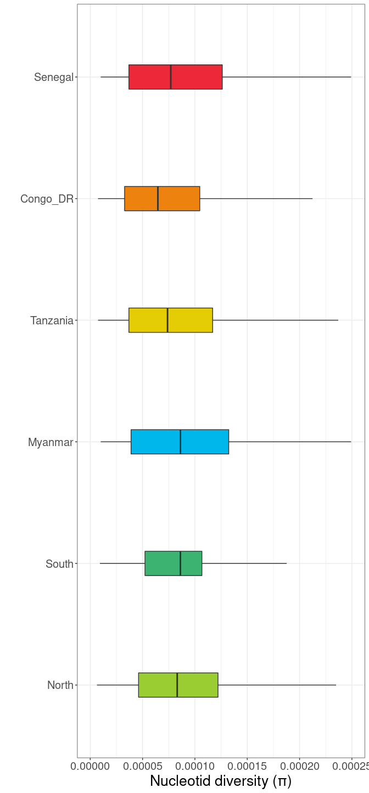
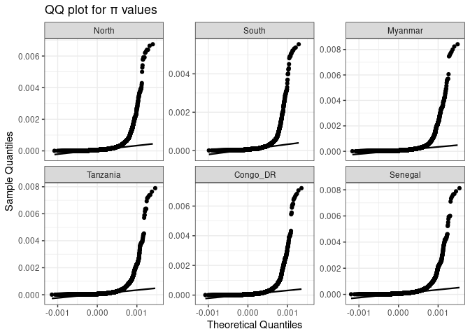
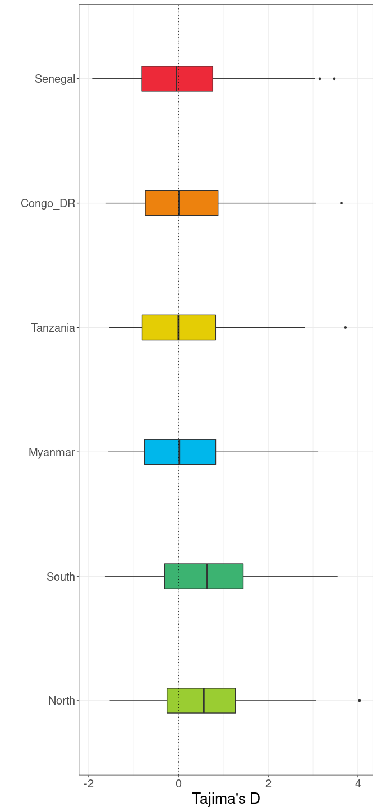
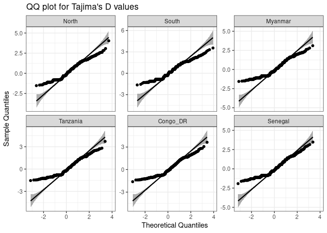
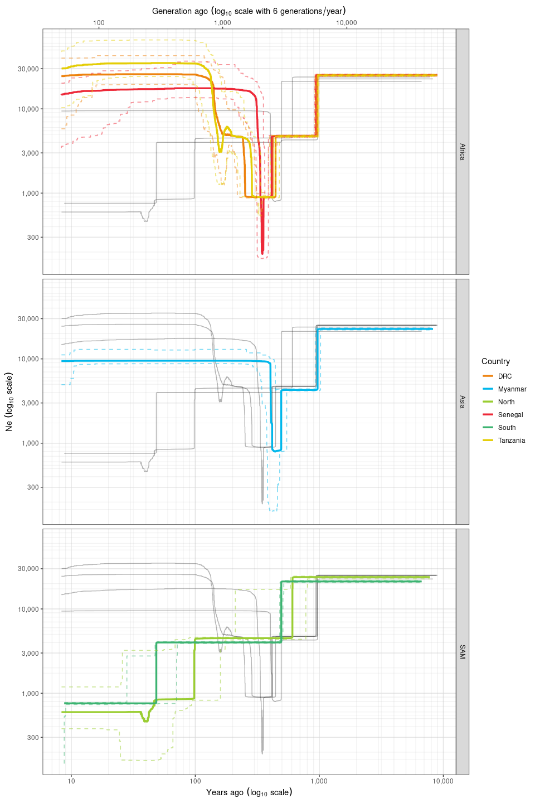

Population genetic diversity and demographic history
================
Margaux Lefebvre
2022-10-11

This repository is for this paper: (citation)

All the data are available here:

The languages used are mainly bash and R.

# $\pi$ and Tajima’s *D*

We have to standardize the sampling size for each population. The
smaller population size is 20 for SAM North, I have to choose randomly
20 samples for each population.

``` r
library(readr)
 filtered_samples <- read_delim("../Data/filtered_samples.txt", 
     delim = "\t", escape_double = FALSE, 
    trim_ws = TRUE)
 pop <- c("Congo_DR","Senegal","Tanzania","Myanmar","SAM_South")
 for (country in pop){
   temp<-subset(filtered_samples, filtered_samples$Country==country)
   random_sample<-sample(temp$Sample, 20)
   write_tsv(as.data.frame(random_sample), paste0("./",country,"_random.txt"), col_names = F)
 }
```

For each country, we calculate $\pi$ per 5 kb sliding window with a 500
bp step, and Tajima’s D with windows of 5kb.

``` bash
for PopId in Congo_DR Senegal Tanzania Myanmar North South
do
# Pi
vcftools --gzvcf  all_genome_samples_filter.vcf.gz --keep ${PopId}_random.txt --window-pi 5000 --window-pi-step 500 --out ./pi/${PopId} &
# Tajima D
vcftools --gzvcf all_genome_samples_filter.vcf.gz --keep ${PopId}_random.txt --TajimaD 5000 --out ./Tajima/${PopId} &
done
```

## $\pi$

**Reading the data:**

``` r
keep_pop<-c("Congo_DR","Senegal","Tanzania","Myanmar","North","South")
vec_pop<-keep_pop[-1]
pop <- keep_pop[1]
pi <- read_delim(paste0("./Data/pi/",pop,".windowed.pi"),"\t", escape_double = FALSE, trim_ws = TRUE, show_col_types = FALSE)
Country<- rep(pop, each=(length(pi$CHROM)))
pi <- cbind (pi, Country)
for (i in vec_pop) {
  path <- paste0("./Data/pi/",i,".windowed.pi")
  temp <- read_delim(path,"\t", escape_double = FALSE, trim_ws = TRUE, show_col_types = FALSE)
  Country<- rep(i, each=(length(temp$CHROM)))
  temp <- cbind (temp, Country)
  pi <- rbind (pi, temp)
}
```

**Plot:**

``` r
pi$Country<-factor(pi$Country, levels=c("North", "South", "Myanmar", "Tanzania", "Congo_DR", "Senegal"))

q <- ggplot(pi, aes(x=PI, y=Country, fill=Country), color="black")+
  geom_boxplot(width=0.2, alpha=1,outlier.shape = NA)+
  ylab("")+
    xlim(c(0,0.00025)) +
  xlab("Nucleotid diversity (\u03c0)")+
  scale_fill_manual(values = c("#9ACD32","#3CB371","#00B7EB","#E4CD05","#ED820E", "#ED2939"))+theme_bw()+ 
  theme(
    panel.spacing.y = unit(0.1, "lines"),
    axis.text.x = element_text(size = 15),
    axis.title.x = element_text(size = 20),
    axis.text.y = element_text(size = 15),
    axis.title.y = element_text(size = 20),
    legend.position = "none"
  )
q
```

<!-- -->

**Are the distributions normal ? (QQplot and Shapiro test)**

``` r
library(qqplotr)
library(MASS)
library(rstatix)
# Plot
pi %>%
  ggplot(aes(sample = PI)) +
     stat_qq_band() +
 stat_qq_line() +
 stat_qq_point()+ labs(x = "Theoretical Quantiles", y = "Sample Quantiles")+ ggtitle("QQ plot for \u03c0 values")+
  facet_wrap(~Country, scales = "free_y")+theme_bw()
```

<!-- -->

The distributions are not normal.

**Are the distribution different ? (non parametric test as the
distributions are not normal)**

``` r
library(rstatix)
knitr::kable(pi %>% 
  wilcox_test(PI ~ Country, p.adjust.method = "bonferroni"))
```

| .y. | group1   | group2   |    n1 |    n2 | statistic |        p |    p.adj | p.adj.signif |
|:----|:---------|:---------|------:|------:|----------:|---------:|---------:|:-------------|
| PI  | North    | South    | 21232 | 15544 | 168019476 | 3.00e-03 | 0.042000 | \*           |
| PI  | North    | Myanmar  | 21232 | 26243 | 273806825 | 1.00e-03 | 0.019000 | \*           |
| PI  | North    | Tanzania | 21232 | 25031 | 281548540 | 0.00e+00 | 0.000000 | \*\*\*\*     |
| PI  | North    | Congo_DR | 21232 | 24773 | 303619994 | 0.00e+00 | 0.000000 | \*\*\*\*     |
| PI  | North    | Senegal  | 21232 | 25593 | 269983640 | 2.39e-01 | 1.000000 | ns           |
| PI  | South    | Myanmar  | 15544 | 26243 | 196319275 | 0.00e+00 | 0.000000 | \*\*\*\*     |
| PI  | South    | Tanzania | 15544 | 25031 | 203769774 | 0.00e+00 | 0.000000 | \*\*\*\*     |
| PI  | South    | Congo_DR | 15544 | 24773 | 220563700 | 0.00e+00 | 0.000000 | \*\*\*\*     |
| PI  | South    | Senegal  | 15544 | 25593 | 194172534 | 4.89e-05 | 0.000734 | \*\*\*       |
| PI  | Myanmar  | Tanzania | 26243 | 25031 | 354815718 | 0.00e+00 | 0.000000 | \*\*\*\*     |
| PI  | Myanmar  | Congo_DR | 26243 | 24773 | 379757284 | 0.00e+00 | 0.000000 | \*\*\*\*     |
| PI  | Myanmar  | Senegal  | 26243 | 25593 | 338803632 | 7.90e-02 | 1.000000 | ns           |
| PI  | Tanzania | Congo_DR | 25031 | 24773 | 341192502 | 0.00e+00 | 0.000000 | \*\*\*\*     |
| PI  | Tanzania | Senegal  | 25031 | 25593 | 297626610 | 0.00e+00 | 0.000000 | \*\*\*\*     |
| PI  | Congo_DR | Senegal  | 24773 | 25593 | 267500830 | 0.00e+00 | 0.000000 | \*\*\*\*     |

## Tajima’s *D*

**Reading the data:**

``` r
keep_pop<-c("Congo_DR","Senegal","Tanzania","Myanmar","North","South")
vec_pop<-keep_pop[-1]
pop <- keep_pop[1]
Tajima <- read_delim(paste0("./Data/Tajima/",pop,".Tajima.D"),"\t", escape_double = FALSE, trim_ws = TRUE, show_col_types = FALSE)
Country<- rep(pop, each=(length(Tajima$CHROM)))
Tajima <- cbind (Tajima, Country)

for (i in vec_pop) {
  path <- paste0("./Data/Tajima/",i,".Tajima.D")
  temp <- read_delim(path,"\t", escape_double = FALSE, trim_ws = TRUE, show_col_types = FALSE)
  Country<- rep(i, each=(length(temp$CHROM)))
  temp <- cbind (temp, Country)
  Tajima <- rbind (Tajima, temp)
}
```

**Plot:**

``` r
Tajima$Country<-factor(Tajima$Country, levels=c("North", "South", "Myanmar", "Tanzania", "Congo_DR", "Senegal"))

q <- ggplot(Tajima, aes(x=TajimaD, y=Country, fill=Country), color="black")+
  geom_boxplot(width=0.2, alpha=1, outlier.size=1, outlier.alpha = 1)+
  ylab("")+
  xlab("Tajima's D")+
  scale_fill_manual(values = c("#9ACD32","#3CB371","#00B7EB","#E4CD05","#ED820E", "#ED2939"))+theme_bw()+ 
  theme(
    panel.spacing.y = unit(0.1, "lines"),
    axis.text.x = element_text(size = 15),
    axis.title.x = element_text(size = 20),
    axis.text.y = element_text(size = 15),
    axis.title.y = element_text(size = 20),
    legend.position = "none"
  )
q+geom_vline(xintercept = 0, linetype="dotted")
```

<!-- -->

**Are the distributions normal ? (QQplot and Shapiro test)**

``` r
library(qqplotr)
library(MASS)
library(rstatix)
# Plot
Tajima %>%
  ggplot(aes(sample = TajimaD)) +
     stat_qq_band() +
 stat_qq_line() +
 stat_qq_point()+ labs(x = "Theoretical Quantiles", y = "Sample Quantiles")+ ggtitle("QQ plot for Tajima's D values")+
  facet_wrap(~Country, scales = "free_y")+theme_bw()
```

<!-- -->

``` r
# Shapiro test
knitr::kable(Tajima %>% 
  group_by(Country) %>%
  shapiro_test(TajimaD))
```

| Country  | variable | statistic |   p |
|:---------|:---------|----------:|----:|
| North    | TajimaD  | 0.9723080 |   0 |
| South    | TajimaD  | 0.9667363 |   0 |
| Myanmar  | TajimaD  | 0.9501857 |   0 |
| Tanzania | TajimaD  | 0.9490603 |   0 |
| Congo_DR | TajimaD  | 0.9473034 |   0 |
| Senegal  | TajimaD  | 0.9508103 |   0 |

The distributions are not normal.

**Are the distribution different ? (non parametric test as the
distributions are not normal)**

``` r
knitr::kable(Tajima %>% 
  wilcox_test(TajimaD  ~ Country, p.adjust.method = "bonferroni"))
```

| .y.     | group1   | group2   |   n1 |   n2 | statistic |        p | p.adj | p.adj.signif |
|:--------|:---------|:---------|-----:|-----:|----------:|---------:|------:|:-------------|
| TajimaD | North    | South    | 4226 | 4225 |   1551976 | 0.009000 | 0.132 | ns           |
| TajimaD | North    | Myanmar  | 4226 | 4233 |   3535183 | 0.000000 | 0.000 | \*\*\*\*     |
| TajimaD | North    | Tanzania | 4226 | 4227 |   3316384 | 0.000000 | 0.000 | \*\*\*\*     |
| TajimaD | North    | Congo_DR | 4226 | 4230 |   3205471 | 0.000000 | 0.000 | \*\*\*\*     |
| TajimaD | North    | Senegal  | 4226 | 4230 |   3470020 | 0.000000 | 0.000 | \*\*\*\*     |
| TajimaD | South    | Myanmar  | 4225 | 4233 |   2651072 | 0.000000 | 0.000 | \*\*\*\*     |
| TajimaD | South    | Tanzania | 4225 | 4227 |   2482870 | 0.000000 | 0.000 | \*\*\*\*     |
| TajimaD | South    | Congo_DR | 4225 | 4230 |   2413960 | 0.000000 | 0.000 | \*\*\*\*     |
| TajimaD | South    | Senegal  | 4225 | 4230 |   2597758 | 0.000000 | 0.000 | \*\*\*\*     |
| TajimaD | Myanmar  | Tanzania | 4233 | 4227 |   3269150 | 0.348000 | 1.000 | ns           |
| TajimaD | Myanmar  | Congo_DR | 4233 | 4230 |   3146772 | 0.011000 | 0.159 | ns           |
| TajimaD | Myanmar  | Senegal  | 4233 | 4230 |   3462476 | 0.250000 | 1.000 | ns           |
| TajimaD | Tanzania | Congo_DR | 4227 | 4230 |   2977102 | 0.012000 | 0.177 | ns           |
| TajimaD | Tanzania | Senegal  | 4227 | 4230 |   3327947 | 0.032000 | 0.486 | ns           |
| TajimaD | Congo_DR | Senegal  | 4230 | 4230 |   3375822 | 0.000158 | 0.002 | \*\*         |

# Stairway Plot 2

## Create the SFS

Our genome is polarize thanks to the outgroup *Plasmodium
praefalciparum* (see
[here](https://github.com/MargauxLefebvre/P.falciparum_americas/tree/main/creating_data_set#plasmodium-praefalciparum-as-an-outgroup).
With the script [easySFS.py](https://github.com/isaacovercast/easySFS)
(last accessed December 19, 2021), we used projection to avoid bias due
to missing data and thus obtain the SFS. The population assignment file
is a plain text file with two columns (tab-separated), one for sample
names and one for the population the sample belongs to.

``` bash
$path_easySFS/easySFS.py -i SFS_unfold.vcf.gz -p pop_cluster.txt -a --preview --unfolded
# order : Tanzania, North, Myanmar, Congo_DR, Senegal, South
$path_easySFS/easySFS.py -i SFS_unfold.vcf.gz -p pop_cluster.txt -a --unfolded --proj=296,28,182,220,102,38
```

## The blueprint file

Stairway plot works with a “blueprint file” (look at the
[documentation](https://github.com/xiaoming-liu/stairway-plot-v2/blob/master/READMEv2.1.pdf)).

Here the parameters we used:

-   **mu**: assumed mutation rate per site, per generation.From [Otto et
    al., (2018)](https://doi.org/10.1038/s41564-018-0162-2), mu ranges
    from 6.952e-9 to 1.158e-9 per base-pair per generation. The value
    right between those two is 4.055e-09.
-   **L**: length of sequence or more precisely the total number of
    observed nucleic sites (after filtering), including polymorphs and
    monomorphs. As we polarize the genome, we count only the sites of
    the polarizable core genome, which is 31,892 nt.
-   **Generation time**: we assumed 6 generations/year here. But it can
    be changed easily in the graphical representations

## Running and results

**Running Stairway plot 2:**

``` bash
unset DISPLAY # We can't use the display in the HPC
java -cp stairway_plot_es Stairbuilder ${pop}.blueprint #create the input
bash ${pop}.blueprint.sh #run stairway plot
```

**Plots:** We use the “final.summary” output from Stairway plot 2.

``` r
## Reading data
Pays<-c( "North", "South","Tanzania","Myanmar","DRC","Senegal")
for (p in Pays){
  path<-paste0("./Data/",p,".summary")
  dt <- read.delim(path)
  dt$Gen<-dt$year*6
  dt<-subset(dt, dt$Gen>50)
  dt$Country<-paste0(p)
  name_dt<-paste0("Ne_",p)
  assign(name_dt, dt)
}
Total<-rbind(Ne_DRC, Ne_Myanmar, Ne_North, Ne_Senegal, Ne_South, Ne_Tanzania)

## Plot
ymax<-max(Total$Ne_median)
tmp <- Total %>%
  mutate(name2=Country)
# add the cluster info
Cluster<- rep(NA, length(tmp$Country))
Cluster[grep("DRC", tmp$Country)] <- "Africa"
Cluster[grep("Senegal", tmp$Country)] <- "Africa"
Cluster[grep("Myanmar", tmp$Country)] <- "Asia"
Cluster[grep("South", tmp$Country)] <- "SAM"
Cluster[grep("French Guiana", tmp$Country)] <- "SAM"
Cluster[grep("Tanzania", tmp$Country)] <- "Africa"
Cluster[grep("North", tmp$Country)] <- "SAM"
Cluster[grep("Colombia", tmp$Country)] <- "SAM"
Cluster[grep("Haiti", tmp$Country)] <- "SAM"

tmp<-cbind(tmp,Cluster)

tmp %>%
  ggplot( aes(x=year, y=Ne_median)) +
    annotation_logticks(short = unit(1, "npc"), mid = unit(1, "npc"), long = unit(1,"npc"), color="grey",alpha = 0.2)  +
    geom_line( data=tmp %>% dplyr::select(-Cluster), aes(group=name2), color="black", size=0.5, alpha=0.3) +
    geom_line( aes(color=Country), size=1.2 )+
  geom_line( aes(color=Country,y=Ne_2.5.), size=0.6,linetype="dashed",alpha=0.5 )+
  geom_line( aes(color=Country,y=Ne_97.5.), size=0.6,linetype="dashed",alpha=0.5)+
 theme(panel.grid = element_blank(), panel.background = element_blank(), legend.position="none",
      axis.text.x = element_text(size = 11),
      axis.text.y = element_text(size = 11),
      axis.title.y = element_text(size=15),
     axis.title.x = element_text(size=15),
     strip.text = element_text(size = 12))+
  scale_color_manual(values = c("#ED820E","#00B7EB", "#9ACD32","#ED2939","#3CB371","#E4CD05"))+
   scale_fill_manual(values = c("#ED820E","#00B7EB", "#9ACD32","#ED2939","#3CB371","#E4CD05"))+
  scale_x_log10(labels=scales::comma, sec.axis = sec_axis(~.*6, name = expression(Generation~ago~(log[10]~scale~with~6~generations/year)), labels=scales::comma))+
  scale_y_log10(labels=scales::comma)+theme_bw()+
    facet_wrap(Cluster~., ncol = 1, strip.position = "right")+
  xlab(expression(Years~ago~(log[10]~ scale)))+
  ylab(expression(Ne~(log[10]~ scale)))
```

<!-- -->

# Softwares and version

-   vcftools 0.1.16
-   [easySFS](https://github.com/isaacovercast/easySFS) (last accessed
    December 19, 2021)
-   Python 3.9.5 (for easySFS)
-   Stairway plot 2.1
-   java jre 1.8.111 (for Stairway plot)

**R session info and packages:**

    ## R version 4.2.1 (2022-06-23)
    ## Platform: x86_64-pc-linux-gnu (64-bit)
    ## Running under: Ubuntu 22.04.1 LTS
    ## 
    ## Matrix products: default
    ## BLAS:   /usr/lib/x86_64-linux-gnu/blas/libblas.so.3.10.0
    ## LAPACK: /usr/lib/x86_64-linux-gnu/lapack/liblapack.so.3.10.0
    ## 
    ## locale:
    ##  [1] LC_CTYPE=fr_FR.UTF-8       LC_NUMERIC=C              
    ##  [3] LC_TIME=fr_FR.UTF-8        LC_COLLATE=fr_FR.UTF-8    
    ##  [5] LC_MONETARY=fr_FR.UTF-8    LC_MESSAGES=fr_FR.UTF-8   
    ##  [7] LC_PAPER=fr_FR.UTF-8       LC_NAME=C                 
    ##  [9] LC_ADDRESS=C               LC_TELEPHONE=C            
    ## [11] LC_MEASUREMENT=fr_FR.UTF-8 LC_IDENTIFICATION=C       
    ## 
    ## attached base packages:
    ## [1] stats     graphics  grDevices utils     datasets  methods   base     
    ## 
    ## other attached packages:
    ##  [1] rstatix_0.7.0   MASS_7.3-58.1   qqplotr_0.0.5   forcats_0.5.2  
    ##  [5] stringr_1.4.1   dplyr_1.0.9     purrr_0.3.4     readr_2.1.2    
    ##  [9] tidyr_1.2.0     tibble_3.1.8    ggplot2_3.3.6   tidyverse_1.3.2
    ## 
    ## loaded via a namespace (and not attached):
    ##  [1] lubridate_1.8.0     assertthat_0.2.1    digest_0.6.29      
    ##  [4] utf8_1.2.2          R6_2.5.1            cellranger_1.1.0   
    ##  [7] backports_1.4.1     reprex_2.0.2        evaluate_0.16      
    ## [10] httr_1.4.4          highr_0.9           pillar_1.8.1       
    ## [13] rlang_1.0.4         googlesheets4_1.0.1 readxl_1.4.1       
    ## [16] rstudioapi_0.14     car_3.1-0           rmarkdown_2.16     
    ## [19] labeling_0.4.2      googledrive_2.0.0   bit_4.0.4          
    ## [22] munsell_0.5.0       broom_1.0.1         compiler_4.2.1     
    ## [25] modelr_0.1.9        xfun_0.32           pkgconfig_2.0.3    
    ## [28] htmltools_0.5.3     tidyselect_1.1.2    codetools_0.2-18   
    ## [31] fansi_1.0.3         crayon_1.5.1        tzdb_0.3.0         
    ## [34] dbplyr_2.2.1        withr_2.5.0         grid_4.2.1         
    ## [37] jsonlite_1.8.0      gtable_0.3.0        lifecycle_1.0.1    
    ## [40] DBI_1.1.3           magrittr_2.0.3      scales_1.2.1       
    ## [43] carData_3.0-5       cli_3.3.0           stringi_1.7.8      
    ## [46] vroom_1.5.7         farver_2.1.1        fs_1.5.2           
    ## [49] robustbase_0.95-0   xml2_1.3.3          ellipsis_0.3.2     
    ## [52] generics_0.1.3      vctrs_0.4.1         tools_4.2.1        
    ## [55] bit64_4.0.5         glue_1.6.2          DEoptimR_1.0-11    
    ## [58] hms_1.1.2           abind_1.4-5         parallel_4.2.1     
    ## [61] fastmap_1.1.0       yaml_2.3.5          colorspace_2.0-3   
    ## [64] gargle_1.2.0        rvest_1.0.3         knitr_1.40         
    ## [67] haven_2.5.1
