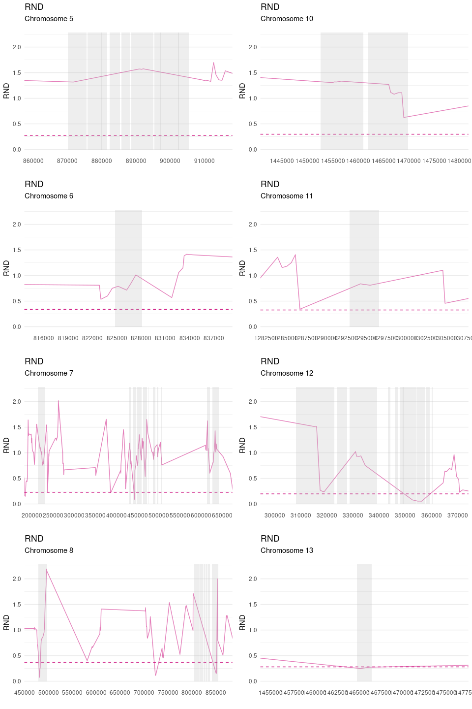

Detection of introgression
================
Margaux Lefebvre
2022-10-12

This repository is for this paper: (citation)

All the data are available here:

The languages used are mainly bash and R.

# *RND*

51 genes distributed on 8 chromosomes (5, 6, 7, 8, 10, 11, 12, 13) show
evidence of positive selection in both SAM North and SAM South : the
genes concerned are therefore our candidates for introgression. To
detect traces of local introgression, we used a genome scan of the
*Relative Node Depth* (*RND*). The *RND* is calculated as: $$
RND=\frac{d_{XY}}{(d_{XO}+d_{YO})/2}
$$ Source: [Feder *et al.*
2005](https://doi.org/10.1073/pnas.0502099102)

In order to calculate *RND*, I needed the *d<sub>XY</sub>* value between
my three clusters : SAM South, SAM North and Senegal. For this I used
the script
[popgenWindows.py](https://github.com/simonhmartin/genomics_general)
(accessed in December 2021). This script need processed `.vcf` format
called `.geno` as an input. It looks like this :

    #CHROM      POS      ind1      ind2      ind3
    scaffold1  1        A/A       A/G       G|A
    scaffold1  1        N/N       T/T       T|C

Missing data is denoted as `N`, and phased and unphased genotypes are
shown conventionally with `|` and `/`. The script
[parseVCF.py](https://github.com/simonhmartin/genomics_general)
(accessed in December 2021), will convert vcf to this format.

``` bash
git clone https://github.com/simonhmartin/genomics_general.git

# Convert into the right format
python ./genomics_general/VCF_processing/parseVCF.py -i all_genome_samples_filter.vcf.gz | bgzip > all_genome.geno.gz &

# Running the script
python ./genomics_general/popgenWindows.py --windType coordinate -w 5000 --stepSize 1000 -m 20  -g .all_genome.geno.gz -o dist_50_intro.cluster.csv.gz -f phased -T 5 -p North -p South -p Senegal --popsFile popmap_intro.cluster.txt
```

Here, we ran the *d<sub>XY</sub>* between the three clusters. We set up
a sliding window of 5kb with a step size of 1kb and 20 SNPs minimum by
windows. The outgroup is Senegal.

**Reading the data and calculating RND:**

``` r
data <- read.csv("./Data/dist_intro.cluster.csv.gz")
data <- data[,-c(6:8,13:14)]

# RND between North and South (with Senegal as outgroup)
data$RND_North.South<-data$dxy_North_South/((data$dxy_North_Senegal+data$dxy_South_Senegal)/2)
```

**Plots:**

``` r
# Plot
data$scaffold<-as.numeric(as.factor(data$scaffold))

  Intro_pos <- read_table("./Data/candidate_gene.txt")
  Intro_pos$Chr <- as.numeric(Intro_pos$Chr)

for (c in unique(Intro_pos$Chr)){
tempc<-subset(data, data$scaffold==c)
tempc<-na.omit(tempc)
threshold.RND <- quantile(tempc$RND_North.South, 0.05, na.rm = T)

all<-c(data$RND_North.South)
  p1<-ggplot(tempc, aes(x = mid)) +
   labs(x = "", y = "RND", title="RND",subtitle = paste0("Chromosome ",c)) +
        theme_minimal()+
    geom_line(aes(x = mid , y =RND_North.South), color = "#c90076", alpha= 0.5)+
    geom_hline(yintercept = threshold.RND, color = "#c90076", linetype = "dashed")
  # Adding the highlight of region
  highlight<-subset(Intro_pos, Intro_pos$Chr==c)
  # This part deals with the case where a chromosome contains several candidate regions for introgression.
  if (length(highlight$ID)>1){
    for (g in highlight$ID){
      temp<-subset(highlight, highlight$ID==g)
      p2<-p1+annotate("rect", xmin = min(temp$Start), xmax = max(temp$End), ymin = 0, ymax = max(all, na.rm = T), alpha = 0.25, fill = "grey")
      p1 <- p2
    }
  } else {p2<-p1+annotate("rect", xmin = min(highlight$Start), xmax = max(highlight$End), ymin = 0, ymax = max(all, na.rm = T), alpha = 0.25, fill = "grey")}
  p2 <- p2+    theme( 
      legend.position = "none",
      panel.border = element_blank(),
      panel.grid.major.x = element_blank(),
      panel.grid.minor.x = element_blank(),
      axis.text.x = element_text())+scale_x_continuous(breaks = scales::breaks_extended(n = 10)) + coord_cartesian(xlim = c(min(highlight$Start)-10000, max(highlight$End)+10000))
  name_plot<-paste0("RND_",c)
  assign(name_plot, p2)
}
  library(gridExtra)
  layout.matrix <- matrix(c(1,2,3,4,5,6,7,8), nrow = 4, ncol= 2)
  grid.arrange(RND_5,RND_6,RND_7,RND_8, RND_10, RND_11, RND_12, RND_13,  ncol=2,nrow=4,layout_matrix = layout.matrix)
```

<!-- -->

# Haplotype networks

From the RND results, 5 regions seems to bear trace of introgression.
So, we investigate deeper with haplotype networks, in comparison between
SAM clusters and Senegal (African outgroup).

``` bash
# Individuals to keep
echo "$(cat ./country_filtered/Brazil.txt)" > keep.ind
echo "$(cat ./country_filtered/French_Guiana.txt)" >> keep.ind
echo "$(cat ./country_filtered/Colombia.txt)" >> keep.ind
echo "$(cat ./country_filtered/Haiti.txt)" >> keep.ind
echo "$(cat ./country_filtered/Senegal.txt)" >> keep.ind
echo "$(cat ./country_filtered/Peru.txt)" >> keep.ind

# Traits matrix (assignation of population)
echo " Brazil French_Guiana Colombia Haiti Senegal Peru" > traits_matrix.txt
while read line; do echo "${line} 1 0 0 0 0 0" >> traits_matrix.txt ; done < ./country_filtered/Brazil.txt
while read line; do echo "${line} 0 1 0 0 0 0" >> traits_matrix.txt ; done < ./country_filtered/French_Guiana.txt
while read line; do echo "${line} 0 0 1 0 0 0" >> traits_matrix.txt ; done < ./country_filtered/Colombia.txt
while read line; do echo "${line} 0 0 0 1 0 0" >> traits_matrix.txt ; done < ./country_filtered/Haiti.txt
while read line; do echo "${line} 0 0 0 0 1 0" >> traits_matrix.txt ; done < ./country_filtered/Senegal.txt
while read line; do echo "${line} 0 0 0 0 0 1" >> traits_matrix.txt ; done < ./country_filtered/Peru.txt

# For each gene we prepare the nexus matrix
# PF3D7_0709900
vcftools --gzvcf  all_genome_samples_filter.vcf.gz --keep keep.ind \
--chr Pf3D7_07_v3 --from-bp 438115 --to-bp 445951 \
--recode --recode-INFO-all --stdout | bgzip -c > PF3D7_0709900.vcf.gz
python ./vcf2phylip/vcf2phylip.py -i PF3D7_0709900.vcf.gz --output-prefix PF3D7_0709900 -n -p --output-folder nexus_matrix
# PF3D7_08096000
vcftools --gzvcf  all_genome_samples_filter.vcf.gz --keep keep.ind \
--chr Pf3D7_08_v3 --from-bp 479438 --to-bp 497431 \
--recode --recode-INFO-all --stdout | bgzip -c > PF3D7_0809600.vcf.gz
python ./vcf2phylip/vcf2phylip.py -i PF3D7_0809600.vcf.gz --output-prefix PF3D7_0809600 -n -p --output-folder nexus_matrix
# PF3D7_0818700
vcftools --gzvcf  all_genome_samples_filter.vcf.gz --keep keep.ind \
--chr Pf3D7_08_v3 --from-bp 847541 --to-bp 854736 \
--recode --recode-INFO-all --stdout | bgzip -c > PF3D7_0818700.vcf.gz
python ./vcf2phylip/vcf2phylip.py -i PF3D7_0818700.vcf.gz --output-prefix PF3D7_0818700 -n -p --output-folder nexus_matrix
# PF3D7_1207800 & PF3D7_1207700
vcftools --gzvcf  all_genome_samples_filter.vcf.gz --keep keep.ind \
--chr Pf3D7_12_v3 --from-bp 351850 --to-bp 357606 \
--recode --recode-INFO-all --stdout | bgzip -c > PF3D7_12077_800.vcf.gz
python ./vcf2phylip/vcf2phylip.py -i PF3D7_12077_800.vcf.gz --output-prefix PF3D7_12077_800 -n -p --output-folder nexus_matrix
# TRAP
vcftools --gzvcf  all_genome_samples_filter.vcf.gz --keep keep.ind \
--chr Pf3D7_13_v3 --from-bp 1464895 --to-bp 1466619 \
--recode --recode-INFO-all --stdout | bgzip -c > PF3D7_1335900.vcf.gz
python ./vcf2phylip/vcf2phylip.py -i PF3D7_1335900.vcf.gz --output-prefix PF3D7_1335900 -n -p --output-folder nexus_matrix
```

After, we create the haplotypes networks with
[PopART](http://popart.otago.ac.nz/index.shtml) with the nexus matrix we
made.

# Software and version

-   vcftools 0.1.16
-   [genomic general
    scripts](https://github.com/simonhmartin/genomics_general) (accessed
    in December 2021)
-   [vcf2philip scripts](https://github.com/edgardomortiz/vcf2phylip)
    (accessed in December 2021)
-   Python 3.9.5 (for vcf2phylip & genomic general scripts)

**R session info and packages:**

    ## R version 4.2.1 (2022-06-23)
    ## Platform: x86_64-pc-linux-gnu (64-bit)
    ## Running under: Ubuntu 22.04.1 LTS
    ## 
    ## Matrix products: default
    ## BLAS:   /usr/lib/x86_64-linux-gnu/blas/libblas.so.3.10.0
    ## LAPACK: /usr/lib/x86_64-linux-gnu/lapack/liblapack.so.3.10.0
    ## 
    ## locale:
    ##  [1] LC_CTYPE=fr_FR.UTF-8       LC_NUMERIC=C              
    ##  [3] LC_TIME=fr_FR.UTF-8        LC_COLLATE=fr_FR.UTF-8    
    ##  [5] LC_MONETARY=fr_FR.UTF-8    LC_MESSAGES=fr_FR.UTF-8   
    ##  [7] LC_PAPER=fr_FR.UTF-8       LC_NAME=C                 
    ##  [9] LC_ADDRESS=C               LC_TELEPHONE=C            
    ## [11] LC_MEASUREMENT=fr_FR.UTF-8 LC_IDENTIFICATION=C       
    ## 
    ## attached base packages:
    ## [1] stats     graphics  grDevices utils     datasets  methods   base     
    ## 
    ## other attached packages:
    ##  [1] gridExtra_2.3   forcats_0.5.2   stringr_1.4.1   dplyr_1.0.9    
    ##  [5] purrr_0.3.4     readr_2.1.2     tidyr_1.2.0     tibble_3.1.8   
    ##  [9] ggplot2_3.3.6   tidyverse_1.3.2
    ## 
    ## loaded via a namespace (and not attached):
    ##  [1] tidyselect_1.1.2    xfun_0.32           haven_2.5.1        
    ##  [4] gargle_1.2.0        colorspace_2.0-3    vctrs_0.4.1        
    ##  [7] generics_0.1.3      htmltools_0.5.3     yaml_2.3.5         
    ## [10] utf8_1.2.2          rlang_1.0.4         pillar_1.8.1       
    ## [13] withr_2.5.0         glue_1.6.2          DBI_1.1.3          
    ## [16] dbplyr_2.2.1        modelr_0.1.9        readxl_1.4.1       
    ## [19] lifecycle_1.0.1     munsell_0.5.0       gtable_0.3.0       
    ## [22] cellranger_1.1.0    rvest_1.0.3         evaluate_0.16      
    ## [25] labeling_0.4.2      knitr_1.40          tzdb_0.3.0         
    ## [28] fastmap_1.1.0       fansi_1.0.3         highr_0.9          
    ## [31] broom_1.0.1         scales_1.2.1        backports_1.4.1    
    ## [34] googlesheets4_1.0.1 jsonlite_1.8.0      farver_2.1.1       
    ## [37] fs_1.5.2            hms_1.1.2           digest_0.6.29      
    ## [40] stringi_1.7.8       grid_4.2.1          cli_3.3.0          
    ## [43] tools_4.2.1         magrittr_2.0.3      crayon_1.5.1       
    ## [46] pkgconfig_2.0.3     ellipsis_0.3.2      xml2_1.3.3         
    ## [49] reprex_2.0.2        googledrive_2.0.0   lubridate_1.8.0    
    ## [52] assertthat_0.2.1    rmarkdown_2.16      httr_1.4.4         
    ## [55] rstudioapi_0.14     R6_2.5.1            compiler_4.2.1
