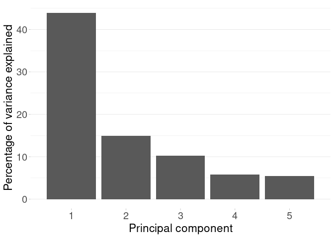
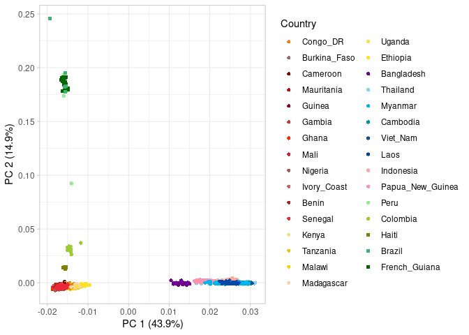
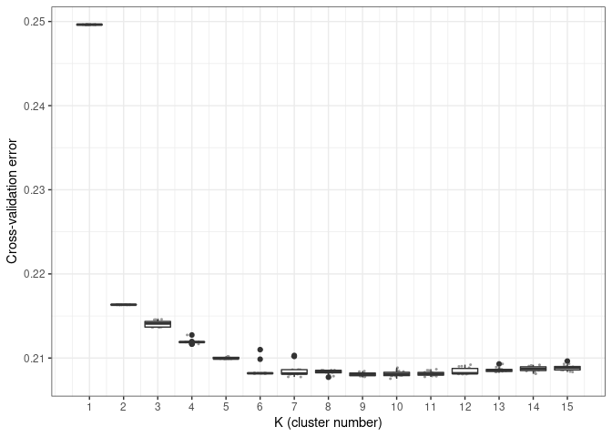
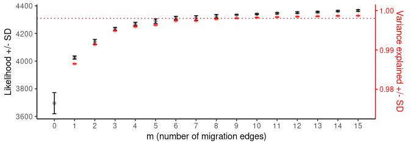
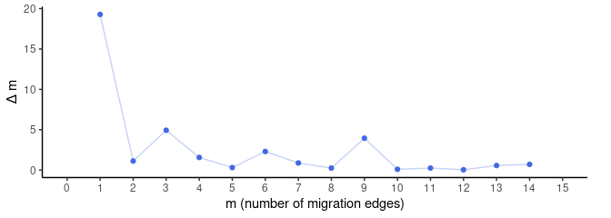
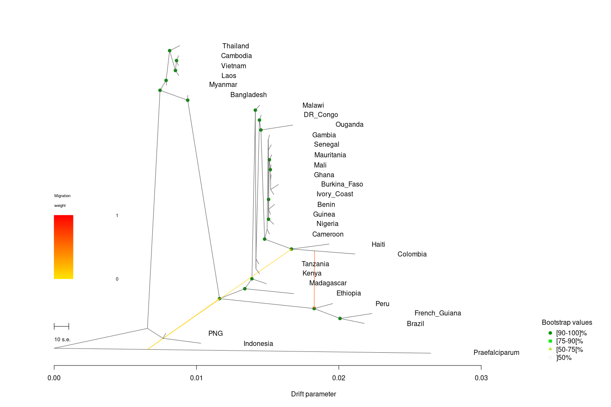
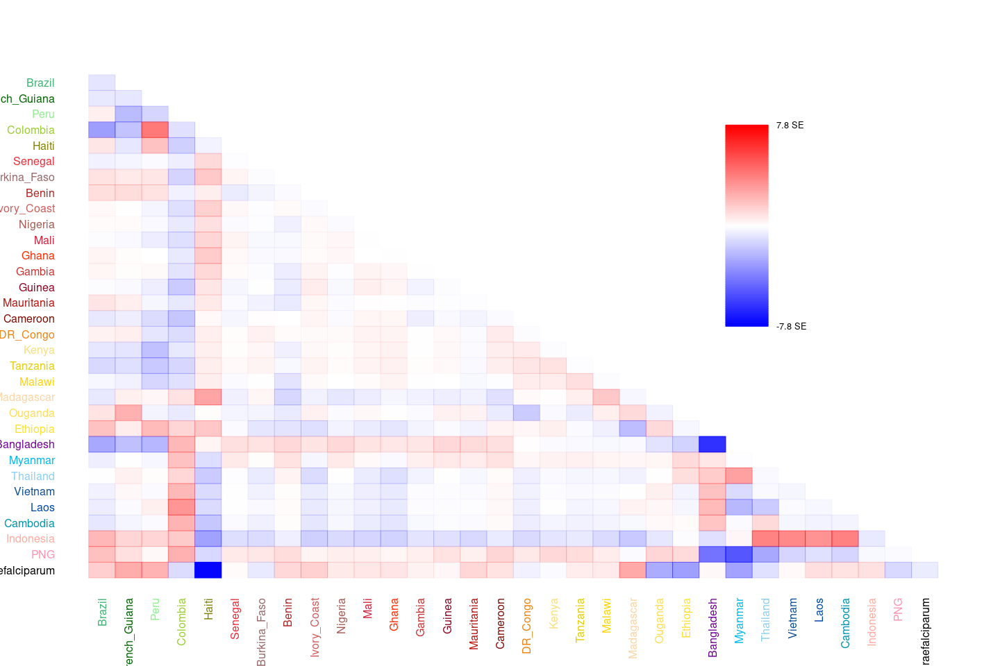
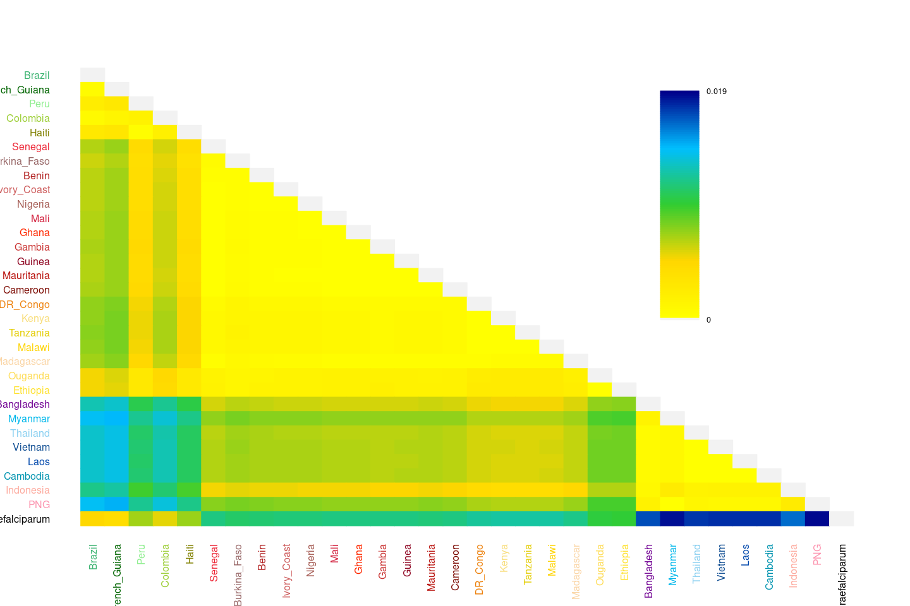
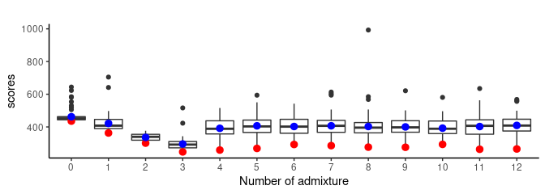

Population structure analysis
================
Margaux Lefebvre
2022-10-12

This repository is for this paper: (citation)

All the data are available here:

The languages used are mainly bash and R.

# PCA

For the PCA, the data must be independent, so we used a LD-pruned
dataset : see
[here](https://github.com/MargauxLefebvre/P.falciparum_americas/tree/main/creating_data_set#ld-pruning-maf-filtering-for-some-analysis).

``` bash
plink2 --vcf all_genome_samples_filter.vcf.gz --double-id --allow-extra-chr --set-missing-var-ids @:# \
--extract Prune.prune.in --geno --maf 0.001 --mind \
--pca --out PCA/PCA_file
```

What did we do here ?

-   `--geno`: 27 variants removed due to missing genotype data.
-   `--maf 0.001`:41921 variants removed due to allele frequency
    threshold.
-   `--mind`: 201 samples removed due to missing genotype data.
-   `--pca`: pca calculated by PLINK 2.

Reading the data:

``` r
pca <- read_table("./Data/PCA_file.eigenvec", col_names = FALSE, col_types =  cols(
  X1 = col_character(),
  X2 = col_character(),
  X3 = col_double(),
  X4 = col_double(),
  X5 = col_double(),
  X6 = col_double(),
  X7 = col_double(),
  X8 = col_double(),
  X9 = col_double(),
  X10 = col_double(),
  X11 = col_double(),
  X12 = col_double()
))

eigenval <- scan("./Data/PCA_file.eigenval")

# Plink sets 2 ID columns. We remove the first one then we rename the columns.
pca <- pca[,-1]
names(pca)[1] <- "Sample"
names(pca)[2:ncol(pca)] <- paste0("PC", 1:(ncol(pca)-1))

# add meta information
Samples_data<-read_delim("./Data/filtered_samples.txt", 
     delim = "\t", show_col_types = FALSE)
pca<-inner_join(pca,Samples_data)
```

**Graph of the eigenvalue:**

``` r
# Set the eigenvalue in percentage of variance explained
pve <- data.frame(PC = 1:10, pve = eigenval/sum(eigenval)*100)

# Plot of only the first 5 PC
a <- ggplot(pve, aes(PC, pve)) + geom_bar(stat = "identity")
a + ylab("Percentage of variance explained ") + xlab("Principal component") + theme_light()+ theme( 
      legend.position = "none",
      panel.border = element_blank(),
      panel.grid.major.x = element_blank(),
      panel.grid.minor.x = element_blank(),
      axis.text.x = element_text(size = 15),
      axis.text.y = element_text(size = 15),
  axis.title.y = element_text(size=17),
     axis.title.x = element_text(size=17))+xlim(0.5,5.5)
```

<!-- -->

**Graph of the PCA:** Each country have a different color, with a color
theme by region. Data added at the Sanger data have a different shape
(square).

``` r
pca$Country<-factor(pca$Country, levels=c("Congo_DR", "Burkina_Faso", "Cameroon" ,"Mauritania","Guinea","Gambia","Ghana", "Mali","Nigeria","Ivory_Coast" ,"Benin", "Senegal","Kenya","Tanzania","Malawi", "Mozambique", "Madagascar", "Uganda", "Ethiopia", "Bangladesh", "Thailand","Myanmar","Cambodia","Viet_Nam", "Laos", "Indonesia", "Papua_New_Guinea", "Peru","Colombia","Haiti", "Brazil","French_Guiana"))

b <- ggplot(pca, aes(PC1, PC2, fill=Country, color=Country, shape = Country)) + geom_point(alpha = 1, size = 1.5) + theme_light() +scale_color_manual(values= c("#ED820E",
"#986868","#7C0A02","#B80F0A","#8D021F","#CA3433", "#FF2800", "#D21F3C", "#A45A52","#CD5C5C", "#B22222","#ED2939",
"#F8DE7E","#E4CD05","#FED300","#FAD5A5","#FEDC56","#FEE12B",
"#710193", "#89CFF0","#00B7EB","#0093AF","#0F4D92","#0047AB","#FDAB9F","#FC94AF",
"#90EE90","#9ACD32","#808000","#3CB371","#006400"))+scale_fill_manual(values= c("#ED820E",
"#986868","#7C0A02","#B80F0A","#8D021F","#CA3433", "#FF2800", "#D21F3C", "#A45A52","#CD5C5C", "#B22222","#ED2939",
"#F8DE7E","#E4CD05","#FED300","#FAD5A5","#FEDC56","#FEE12B",
"#710193", "#89CFF0","#00B7EB","#0093AF","#0F4D92","#0047AB","#FDAB9F","#FC94AF",
"#90EE90","#9ACD32","#808000","#3CB371","#006400")) +
scale_shape_manual(values=c(16, 16, 16, 16, 16,16,16,16,16,16,16,16,16,16,16,16,16,16,16,16,16,16,16,16,16,16,16,16,15,15,15))
b + xlab(paste0("PC 1 (", signif(pve$pve[1], 3), "%)")) + ylab(paste0("PC 2 (", signif(pve$pve[2], 3), "%)"))
```

<!-- -->

# ADMIXTURE

For ADMIXTURE, the data must be independent, so we used a LD-pruned
dataset : see
[here](https://github.com/MargauxLefebvre/P.falciparum_americas/tree/main/creating_data_set#ld-pruning-maf-filtering-for-some-analysis).

``` bash
plink2 --vcf all_genome_samples_filter.vcf.gz --double-id --allow-extra-chr --set-missing-var-ids @:# \
--extract Prune.prune.in --geno --maf 0.001 --mind \
--make-bed --out input_admixture

# Change the format for ADMIXTURE
awk '{$1=0;print $0}' input_admixture.bim > input_admixture.bim.tmp
mv input_admixture.bim.tmp input_admixture.bim
```

What did we do here ?

-   `--geno`: 27 variants removed due to missing genotype data.
-   `--maf 0.001`:41921 variants removed due to allele frequency
    threshold.
-   `--mind`: 201 samples removed due to missing genotype data.
-   `--make-bed`: make a bed file, then transformed in ADMIXTURE input
    format.

``` bash
# Run ADMIXTURE (r the replicate and k the number of clusters)
for r in {1..15}
do
for k in {1..15}
do
 admixture --cv -s time -j20 input_admixture.bed $k >>log_${r}_${k}.out
done
done

# Extract the CV error value
grep "CV" *.out | awk '{print $3,$4}' | sed -e 's/(//;s/)//;s/://;s/K=//'  > K_determination.cv.error
```

**Plot of the CV-errors**

``` r
data_K <- read_table("./Data/K_determination.cv.error", col_names = FALSE)

names(data_K)[1] <- "K"
names(data_K)[2] <- "CVE"

ggplot(data=data_K,aes(x=K,y=CVE, group=K))+
  geom_jitter(width = 0.2, size=0.4,colour="grey60")+
  geom_boxplot()+
  labs(x="K (cluster number)",y="Cross-validation error")+
  scale_x_continuous(breaks =c(1,2, 3, 4, 5, 6, 7, 8, 9, 10, 11,12,13,14,15))+
  theme_bw()
```

<!-- -->

The best K value is 9. Then, the visualisation and the convergence check
of ADMIXTURE graphs were performed using the program *pong*.

# TreeMix

We add a outgroup with *P. praefalciparum* samples. TreeMix assumes
unlinked SNPs, so we prune the file for SNPs in high LD : see
[here](https://github.com/MargauxLefebvre/P.falciparum_americas/tree/main/creating_data_set#ld-pruning-maf-filtering-for-some-analysis).

## The input format

We need the clust file that contain 2 columns with the samples’ names
and the third with the population name.

``` bash
 # Get a .map and .ped file
vcftools --gzvcf P_falci_tree.vcf.gz \
         --plink --remove-indels --max-alleles 2 \
         --out P_falci_tree

# Adjust the map file to allow for non-human chromosome names (else the new plink version struggles)
awk -F"\t" '{
        split($2,chr,":")
    $1="1"
    $2="1:"chr[2]
        print $0
}' P_falci_tree.map > better.map
mv better.map P_falci_tree.map

# convert it to a stratified frq file, also creates .bed, .bim, .fam, .log, .nosex
plink --file P_falci_tree --make-bed --out P_falci_tree --allow-no-sex --allow-extra-chr 0
plink --bfile P_falci_tree --freq --missing --within total.clust --out P_falci_tree --allow-no-sex --allow-extra-chr 0

# zip it
gzip P_falci_tree.frq.strat

# create input file formix
python plink2tree.py P_falci_tree.frq.strat.gz P_falci_tree.tree.frq.gz
```

## Find the optimal number of migration edges

OptM package uses results from the population software Treemix by
[Pickrell and Pritchard (2012)](DOI:10.1371/journal.pgen.1002967) to
estimate the optimal number of migrations edges to add to the tree.
[Here](https://www.rdocumentation.org/packages/OptM/versions/0.1.6) the
link to the documentation.

First, we ran TreeMix 15 times for each migration events (*m*) value,
with *m* ranging from 1 to 15 (for 0, the likelihood is calculated
automatically each times).

``` bash
for i in {1..15}
do
for m in {1..15}
do
 treemix -i P_falci_tree.tree.frq.gz -m $m -root Praefalciparum -o P_falci_treemix.$i.$m -k 500 -seed $RANDOM > treemix_${m}_log$i
done
done
```

Then, we compare all the values of migration edges.

``` r
library(OptM)
# Evanno like method
    test.optM = optM("./Data/treemix_results_total/")
    
# Plots
ylim.prim <- c(min(test.optM$`mean(Lm)`), max(test.optM$`mean(Lm)`))   # in this example, mean(LM)
ylim.sec <- c(min(test.optM$`mean(f)`, na.rm=T)-0.01, 1)    # in this example, mean(f) = variance
b <- diff(ylim.prim)/diff(ylim.sec)
a <- ylim.prim[1] - b*ylim.sec[1]

p1<- ggplot(test.optM, aes(x=m, y=test.optM$`mean(Lm)`)) + 
    geom_point(alpha=0.3)+ scale_y_continuous("Likelihood +/- SD", sec.axis = sec_axis(~ (. - a)/b, name = "Variance explained +/- SD"))+
      geom_errorbar(aes(ymin=test.optM$`mean(Lm)`-test.optM$`sd(Lm)`, ymax=test.optM$`mean(Lm)`+test.optM$`sd(Lm)`), width=.2,position=position_dodge(.9))+theme_classic()+ 
    geom_point(aes(x=m, y=a + b*test.optM$`mean(f)`),alpha=0.3,color="red")+
      scale_x_continuous("m (number of migration edges)", breaks = 0:15) +
  theme(axis.line.y.right = element_line(color = "red"), 
        axis.ticks.y.right = element_line(color = "red"),
        axis.text.y.right = element_text(color = "red"), 
        axis.title.y.right = element_text(color = "red")
        ) +
      geom_errorbar(aes(ymin=(a + b*test.optM$`mean(f)`)-test.optM$`sd(f)`, ymax=(a + b*test.optM$`mean(f)`)+test.optM$`sd(f)`), width=.2, position=position_dodge(.9), color="red")+
      geom_hline(yintercept = a+b*0.998, color="red",linetype="dotted")
p1
```

<!-- -->

``` r
ylim.prim_2 <- c(min(test.optM$`mean(Lm)`), max(test.optM$`mean(Lm)`))   # in this example, mean(LM)
ylim.sec_2 <-  c(min(test.optM$`mean(f)`)-0.01, 1)     # in this example, mean(f) = variance
d <- diff(ylim.prim_2)/diff(ylim.sec_2)
c<- ylim.prim_2[1] - d*ylim.sec_2[1]

p2<-ggplot(test.optM, aes(x=m, y=Deltam)) + 
    geom_point(color="royalblue")+geom_line(alpha=0.3, color="royalblue")+scale_y_continuous("\u0394 m", sec.axis = sec_axis(~ (. - c)/d, name = "Variance explained +/- SD"))+
      scale_x_continuous("m (number of migration edges)", breaks = 0:15)+theme_classic()+ geom_point(aes(x=m, y=c + d*test.optM$`mean(f)`),alpha=0,color="white")+
  theme(axis.line.y.right = element_line(color = "white"), 
        axis.ticks.y.right = element_line(color = "white"),
        axis.text.y.right = element_text(color = "white"), 
        axis.title.y.right = element_text(color = "white")
        )
p2
```

<!-- -->

The best *m* value is 3, so we run 100 times TreeMix to have consensus
tree with bootstrap.

## Find the consensus tree

Of course, the tree is rooted with *P. praefalciparum* :
`-root Praefalciparum`.

``` bash
# run TreeMix
for i in {1..100}
do
treemix -i P_falci_tree.treemix.frq.gz -bootstrap -k 500 -se -m 3 -seed $RANDOM -root Praefalciparum -o tree_consensus_m3_tree_bootrep_$i > treemix_total_log$i
done

###### Create a file with all the bootstrapped trees
for a in {1..100}
do
    bootf=tree_consensus_m3_tree_bootrep_$i.treeout.gz
    gunzip -c $bootf | head -1 >> tree_consensus_m3_boottree.tre
done

###### Clean the environment
rm -rf outfile outtree screanout

## Create parameters file
echo tree_consensus_m3_boottree.tre > tree_consensus_m3_PhylipInputFile
    echo "Y" >> tree_consensus_m3_PhylipInputFile

## Run Phylip
/usr/local/phylip-3.696/exe/consense < tree_consensus_m3_PhylipInputFile > screanout

###### The output from Phylip will be modified because:
###### 1) Treemix accept only one line tree
###### 2) Treemix accept newick format file
##sed ':a;N;$!ba;s/\n//g' outtree > $outname"_outtree.newick"
cat outtree | tr -d "\n" > tree_consensus_m3_outtree.newick
echo >> tree_consensus_m3_outtree.newick

###### Run TreeMix with the chosen number of migrations by loading the consensus tree ######
treemix -i P_falci_tree.treemix.frq.gz -m 3 -k 500 -se -tf tree_consensus_m3_outtree.newick -root Praefalciparum -o tree_consensus_m3 > tree_consensus_m3_logfile_tree_boot.log
```

**Consensus tree graph:**

``` r
library(BITE)
treemix.bootstrap(in.file = "./Data/tree_consensus_m3",out.file = "./Data/output_tree_m3",phylip.file = "./Data/tree_consensus_m3_outtree.newick",nboot=100, plotmig = T, boot.legend.location='bottomright')
```

<!-- -->

**Residual and drift:**

``` r
plot_resid("./Data/tree_consensus_m3","./Data/pop.order")
```

<!-- -->

``` r
treemix.drift("./Data/tree_consensus_m3","./Data/pop.order")
```

<!-- -->

# ADMIXTOOLS2

Read the data

``` r
library(admixtools)
prefix = './Data/P_falci_all'
my_f2_dir = './Data/f2_all'

# To run only the first time
# extract_f2(prefix, my_f2_dir,auto_only = FALSE, overwrite = TRUE, blgsize=150)
f2_blocks = f2_from_precomp(my_f2_dir)
```

## Find the best admixture events number

We ran 100 replicates of `find_graphs` to find the best graph for values
of admixture from 0 to 10. To speed up a little the process, we
parallelize the process. Here a example with 0 admixture events :

``` r
#setup parallel backend to use many processors
cores=detectCores()
cl <- makeCluster(cores[1])
registerDoParallel(cl)

# Try with 0 admixture
res<-matrix()
res<-foreach(
  i = 1:100,
  .combine = 'rbind',
  .packages = c("admixtools","magrittr","tidyverse")
) %dopar% {
    temp=find_graphs(f2_blocks,
  numrep = 5,
  numgraphs = 50,
  max_admix = 0,
  outpop = "Praefalciparum",
  stop_gen = 300,
  mutfuns = namedList(spr_leaves, spr_all, swap_leaves, move_admixedge_once, flipadmix_random, mutate_n))
winner = temp%>% slice_min(score, with_ties = FALSE)
return(winner)
  }

# When you're done, clean up the cluster
stopImplicitCluster()

# save the results
saveRDS(res, file='./Data/admixtools/results_nadm0.rds')
```

**Read the data:**

``` r
path<-paste0('./Data/admixtools/results_nadm0.rds')
  final_results<-readRDS(path)
  final_results$nadm<-0
for (i in 1:12){
  path<-paste0('./Data/admixtools/results_nadm',i,'.rds')
  temp<-readRDS(path)
  temp$nadm<-i
  final_results<-rbind(final_results,temp)
}
```

**Make the graph to compare:**

``` r
final_results$nadm<-as.factor(final_results$nadm)
final_results %>%
  ggplot( aes(x=nadm, y=score)) +
    geom_boxplot() +
    theme_classic() +
    theme(
      legend.position="none",
      plot.title = element_text(size=11)
    ) +
    ggtitle("") + ylab("scores")+
    xlab("Number of admixture")+stat_summary(fun.y="min",color="red")+stat_summary(fun.y="mean",color="blue")
```

<!-- -->

So, in average the score is lower with 3 admixtures. With 3 admixtures,
we also have the lowest score possible.

## Find the best graph

We isolate the five best graph and compare them. The lower is the score,
better is the graph.

``` r
winner = final_results%>% slice_min(score, n=5, with_ties = FALSE)
graph1 = winner$edges[[1]]
graph2 = winner$edges[[2]]
graph3 = winner$edges[[3]]
graph4 = winner$edges[[4]]
graph5 = winner$edges[[5]]
```

| Graph | Likelihood score | number of admixture events |
|:-----:|:----------------:|:--------------------------:|
|   1   |     247.2339     |             3              |
|   2   |     250.7824     |             3              |
|   3   |     251.3889     |             3              |
|   4   |     255.7946     |             3              |
|   5   |     258.0765     |             3              |

As they are very close in likelihood score, we compute the goodness of
fit for each graph.

## The goodness of fit

The goodness of fit compares the observed *f*<sub>4</sub> statistics
values among the different alternatives and identifies which graph(s)
best fit with the data. We we will show two graphs that presented the
best goodness of fit with the least *f*<sub>4</sub> statistics outliers

**Calculate the *f*<sub>4</sub>:**

``` r
detach("package:admixturegraph", unload = TRUE)  #to not mess with the f4 function of admixturegraph package
f4_stats<-f4(f2_blocks)
f4_data<-f4_stats[,c(1:5,7)]
colnames(f4_data)<-c("W", "X", "Y","Z", "D", "Z.value")
```

### Graph1

``` r
library(admixturegraph)
# Create the tree
leaves<-unique(c(f4_data$W,f4_data$X,f4_data$Y,f4_data$Z))
total <- unique(c(graph1$from, graph1$to))
inner_nodes <- total[!(total %in% leaves)]

edges <- parent_edges(c(admixture_edge("admixc", "Ethiopia_k", "Rrrlrsx", prop = 0.3597246),
                       admixture_edge("admix", "Mauritania_z", "Rrrlrsx", prop = 0.1888263),
                       admixture_edge("admixe", "Ethiopia_kg", "Rrrlll_e", prop = 0.1670993),
edge("Praefalciparum","R"),
edge("Ethiopia_k","R"),
edge("Ethiopia","Rrl"),
edge("Rrll_m","Rrl"),
edge("Nigeria","Rrllr"),
edge("Rrrlllr","Rrllr"),
edge("Burkina_Faso","Rrllrl"),
edge("Mali_z","Rrllrl"),
edge("Myanmar","Rrllrrl"),
edge("Thailand","Rrllrrl"),
edge("Mauritania_z","Rrlr"),
edge("Rrll_p","Rrlr"),
edge("Rrrllllll","Rrrl"),
edge("Peru","Rrrl"),
edge("Colombia","Rrrlll"),
edge("Rrrl","Rrrlll"),
edge("DR_Congo","Rrrllll"),
edge("Rrrllllw","Rrrllll"),
edge("Brazil","Rrrllllll"),
edge("French_Guiana","Rrrllllll"),
edge("Rrrllrrr","Rrrllllr"),
edge("Rrllrl","Rrrlllr"),
edge("Benin","Rrrlllr"),
edge("Indonesia","Rrrllrr"),
edge("PNG","Rrrllrr"),
edge("Tanzania","Rrrllrrr"),
edge("Malawi","Rrrllrrr"),
edge("Rrrlrr","Rrrlr"),
edge("Rrrlrs","Rrrlr"),
edge("Laos","Rrrlrll"),
edge("Vietnam","Rrrlrll"),
edge("Cambodia","Rrrlrr"),
edge("Rrrlrll","Rrrlrr"),
edge("Ethiopia_kg","Ethiopia_k"),
edge("Rrrlll_e","Mauritania_z"),
edge("Rrrllllr","Rrrllrr_v"),
edge("Rrrllrr","Brazil_q"),
edge("Rrrlr","Brazil_q"),
edge("Madagascar","Rrll_m"),
edge("Rrrllrr_v","Rrll_m"),
edge("Mauritania","Gambia_k"),
edge("Gambia_kn","Gambia_k"),
edge("Cameroon","Rrll_p"),
edge("Guinea_o","Rrll_p"),
edge("Rrllr","Mali_q"),
edge("Senegal","Mali_q"),
edge("Haiti","Rrrlll_e"),
edge("Ghana","Ivory_Coast_d"),
edge("Ivory_Coast","Ivory_Coast_d"),
edge("Mali","Mali_z"),
edge("Ivory_Coast_d","Mali_z"),
edge("Rrllrrl","Rrrlrs"),
edge("Rrrlrsx","Rrrlrs"),
edge("Gambia","Guinea_o"),
edge("Gambia_k","Guinea_o"),
edge("Rrlr","Rrrllllw"),
edge("Ouganda","Rrrllllw"),
edge("Bangladesh","admix"),
edge("Guinea","Gambia_kn"),
edge("Mali_q","Gambia_kn"),
edge("Rrl","admixc"),
edge("Brazil_q","Ethiopia_kg"),
edge("Rrrlll","admixe"),
edge("Rrrllll","Rrrllllr"),
edge("Kenya","Rrrllrr_v")))
falci_graph1 <- agraph(leaves, inner_nodes, edges)

# Run the goodness of fit
f4_filter<-filter_on_leaves(f4_data,falci_graph1)
fit <- fit_graph(f4_filter, falci_graph1)
```

**Results :**

``` r
library(admixturegraph)
fit = readRDS("./Data/fit_graph1.RDS")

sigma=6
x <- stats::fitted(fit)
  D <- x$D
  x$stderr <- x$D/x$Z.value
  x$error_bar_start <- with(x, D - sigma/2*stderr)
  x$error_bar_end   <- with(x, D + sigma/2*stderr)
  x$test <- paste0("D(",x$W,",",x$X,";",x$Y,",",x$Z,")")
  #x$test <- factor(x$test, levels=dplyr::arrange(x, D)$test)
  #x$hit <-between(x$graph_f4, x$error_bar_start, x$error_bar_end)
  x$hit<-NA
  x$hit <-mapply(between,x$graph_f4, x$error_bar_start, x$error_bar_end)
x_outliers<-subset(x, x$hit==F)
print(paste0("There are ",nrow(x_outliers)," f4 outliers on ",nrow(x)," f4 computed in total"))
```

    ## [1] "There are 4062 f4 outliers on 107880 f4 computed in total"

### Graph2

``` r
library(admixturegraph)
# Create the tree
leaves<-unique(c(f4_data$W,f4_data$X,f4_data$Y,f4_data$Z))
total <- unique(c(graph2$from, graph2$to))
inner_nodes <- total[!(total %in% leaves)]
edges <- parent_edges(c(admixture_edge("admixc", "Rtm", "Rrlllrf", prop = 0.2161948),
                       admixture_edge("admix", "Rtmp", "Rrllrqxi", prop = 0.2242650),
                       admixture_edge("admixj", "Rrllrqxix", "Rrlllr", prop = 0.2498188),
edge("Praefalciparum","R"),
edge("Rtm","R"),
edge("Rrllrrrrr","Rrlll"),
edge("Rrllrlll_gs","Rrlll"),
edge("Rrllrll","Rrll"),
edge("Guinea","Guinea_v"),
edge("Rrllrllrrrl","Guinea_v"),
edge("PNG","Malawi_k"),
edge("Indonesia","Malawi_k"),
edge("Rrllllr_a","Rrllll"),
edge("Colombia","Rrllll"),
edge("Rrllllr","Rrllllr_a"),
edge("Peru","Rrllllr_a"),
edge("French_Guiana","Rrllllr"),
edge("Brazil","Rrllllr"),
edge("Rrlllrl","Rrlllrr"),
edge("Laos","Rrlllrr"),
edge("Myanmar","Thailand_q"),
edge("Thailand","Thailand_q"),
edge("Vietnam","Rrlllrl"),
edge("Cambodia","Rrlllrl"),
edge("Mauritania","Rrllrllrrrl"),
edge("Rrllrllrrr_x","Rrllrllrrrl"),
edge("Ivory_Coast_t","Cambodia_s"),
edge("Benin","Cambodia_s"),
edge("Mali","Ivory_Coast_t"),
edge("Ivory_Coast_t_u","Ivory_Coast_t"),
edge("Burkina_Faso","Ivory_Coast_t_u"),
edge("Ghana_l","Ivory_Coast_t_u"),
edge("Cambodia_s","Rrllrllrrr_x"),
edge("Nigeria","Rrllrllrrr_x"),
edge("Ethiopia","Rrllrrrrr"),
edge("Rrllrrrrrr","Rrllrrrrr"),
edge("Madagascar","Rrllrrrrrr"),
edge("Malawi","Tanzania_f"),
edge("Tanzania","Tanzania_f"),
edge("Ouganda","Rrllrq"),
edge("Rrllrqx","Rrllrq"),
edge("Rrlllr","Rrllrlll_gs"),
edge("Rrll","Rrllrqx"),
edge("DR_Congo","Rrllrrrrrr_e"),
edge("Rrllrq","Rrllrrrrrr_e"),
edge("Rrllrrrrrr_e","Malawi_n"),
edge("Rtmp","Rtm"),
edge("Ivory_Coast","Ghana_l"),
edge("Ghana","Ghana_l"),
edge("Guinea_v","Guinea_v_n"),
edge("Senegal","Guinea_v_n"),
edge("Rrlll","Rtmp"),
edge("Tanzania_f","Malawi_n"),
edge("Malawi_n_x","Rrllrrrrrr"),
edge("Malawi_n","Malawi_n_x"),
edge("Kenya","Malawi_n_x"),
edge("Haiti","Rrllrqxi"),
edge("Rrllll","admix"),
edge("Rrlllrf","Rrlllr"),
edge("Rrlllrr","Rrlllrf"),
edge("Malawi_k","admixc"),
edge("Rrllrqxix","Rrllrqx"),
edge("Rrllrqxi","Rrllrqxix"),
edge("Bangladesh","admixj"),
edge("Thailand_q","Rrllrlll_gs"),
edge("Gambia","Rrllrll"),
edge("Guinea_v_n","Rrllrll"),
edge("Cameroon","Rrll")))

falci_graph2 <- agraph(leaves, inner_nodes, edges)

# Run the goodness of fit
f4_filter<-filter_on_leaves(f4_data,falci_graph2)
fit <- fit_graph(f4_filter, falci_graph2)
```

**Results :**

``` r
library(admixturegraph)
fit = readRDS("./Data/fit_graph2.RDS")

sigma=6
x <- stats::fitted(fit)
  D <- x$D
  x$stderr <- x$D/x$Z.value
  x$error_bar_start <- with(x, D - sigma/2*stderr)
  x$error_bar_end   <- with(x, D + sigma/2*stderr)
  x$test <- paste0("D(",x$W,",",x$X,";",x$Y,",",x$Z,")")
  #x$test <- factor(x$test, levels=dplyr::arrange(x, D)$test)
  #x$hit <-between(x$graph_f4, x$error_bar_start, x$error_bar_end)
  x$hit<-NA
  x$hit <-mapply(between,x$graph_f4, x$error_bar_start, x$error_bar_end)
x_outliers<-subset(x, x$hit==F)
print(paste0("There are ",nrow(x_outliers)," f4 outliers on ",nrow(x)," f4 computed in total"))
```

    ## [1] "There are 3923 f4 outliers on 107880 f4 computed in total"

# Software and version

-   PLINK 2 (PCA & ADMIXTURE) and PLINK 1.9 (TreeMix)
-   ADMIXTURE 1.3.0
-   [pong 1.5](https://github.com/ramachandran-lab/pong)
-   Python 3.9.5 (for pong)
-   vcftools 0.1.16
-   TreeMix 1.13
-   Phylip 3.696

**R session info and packages:**

    ## R version 4.2.1 (2022-06-23)
    ## Platform: x86_64-pc-linux-gnu (64-bit)
    ## Running under: Ubuntu 22.04.1 LTS
    ## 
    ## Matrix products: default
    ## BLAS:   /usr/lib/x86_64-linux-gnu/blas/libblas.so.3.10.0
    ## LAPACK: /usr/lib/x86_64-linux-gnu/lapack/liblapack.so.3.10.0
    ## 
    ## locale:
    ##  [1] LC_CTYPE=fr_FR.UTF-8       LC_NUMERIC=C              
    ##  [3] LC_TIME=fr_FR.UTF-8        LC_COLLATE=fr_FR.UTF-8    
    ##  [5] LC_MONETARY=fr_FR.UTF-8    LC_MESSAGES=fr_FR.UTF-8   
    ##  [7] LC_PAPER=fr_FR.UTF-8       LC_NAME=C                 
    ##  [9] LC_ADDRESS=C               LC_TELEPHONE=C            
    ## [11] LC_MEASUREMENT=fr_FR.UTF-8 LC_IDENTIFICATION=C       
    ## 
    ## attached base packages:
    ## [1] stats     graphics  grDevices utils     datasets  methods   base     
    ## 
    ## other attached packages:
    ##  [1] admixturegraph_1.0.2 admixtools_2.0.0     BITE_1.2.0008       
    ##  [4] beanplot_1.3.1       kableExtra_1.3.4     knitr_1.40          
    ##  [7] rmarkdown_2.16       car_3.1-0            carData_3.0-5       
    ## [10] GenABEL_1.8-0        GenABEL.data_1.0.0   MASS_7.3-58.1       
    ## [13] RColorBrewer_1.1-3   reshape2_1.4.4       RCircos_1.1.3       
    ## [16] OptM_0.1.6           forcats_0.5.2        stringr_1.4.1       
    ## [19] dplyr_1.0.9          purrr_0.3.4          readr_2.1.2         
    ## [22] tidyr_1.2.0          tibble_3.1.8         ggplot2_3.3.6       
    ## [25] tidyverse_1.3.2     
    ## 
    ## loaded via a namespace (and not attached):
    ##  [1] fs_1.5.2            lubridate_1.8.0     bit64_4.0.5        
    ##  [4] webshot_0.5.3       httr_1.4.4          tools_4.2.1        
    ##  [7] backports_1.4.1     utf8_1.2.2          R6_2.5.1           
    ## [10] DBI_1.1.3           colorspace_2.0-3    withr_2.5.0        
    ## [13] tidyselect_1.1.2    bit_4.0.4           compiler_4.2.1     
    ## [16] cli_3.3.0           rvest_1.0.3         xml2_1.3.3         
    ## [19] labeling_0.4.2      scales_1.2.1        systemfonts_1.0.4  
    ## [22] digest_0.6.29       svglite_2.1.0       pkgconfig_2.0.3    
    ## [25] htmltools_0.5.3     SiZer_0.1-8         dbplyr_2.2.1       
    ## [28] fastmap_1.1.0       highr_0.9           rlang_1.0.4        
    ## [31] readxl_1.4.1        rstudioapi_0.14     farver_2.1.1       
    ## [34] generics_0.1.3      jsonlite_1.8.0      vroom_1.5.7        
    ## [37] googlesheets4_1.0.1 magrittr_2.0.3      Rcpp_1.0.9         
    ## [40] munsell_0.5.0       fansi_1.0.3         abind_1.4-5        
    ## [43] lifecycle_1.0.1     stringi_1.7.8       yaml_2.3.5         
    ## [46] plyr_1.8.7          grid_4.2.1          parallel_4.2.1     
    ## [49] crayon_1.5.1        haven_2.5.1         hms_1.1.2          
    ## [52] pillar_1.8.1        igraph_1.3.4        codetools_0.2-18   
    ## [55] reprex_2.0.2        glue_1.6.2          evaluate_0.16      
    ## [58] modelr_0.1.9        foreach_1.5.2       vctrs_0.4.1        
    ## [61] tzdb_0.3.0          cellranger_1.1.0    gtable_0.3.0       
    ## [64] assertthat_0.2.1    xfun_0.32           broom_1.0.1        
    ## [67] googledrive_2.0.0   viridisLite_0.4.1   gargle_1.2.0       
    ## [70] iterators_1.0.14    ellipsis_0.3.2
