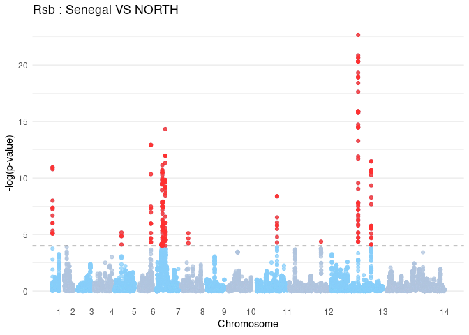
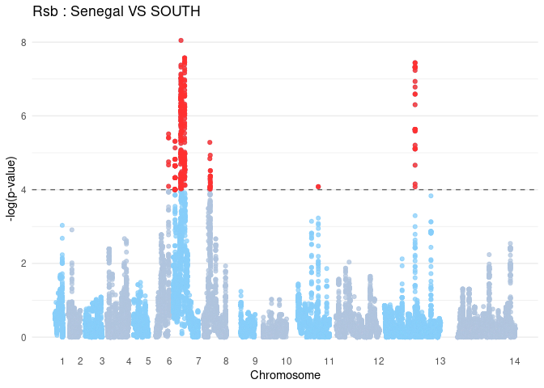
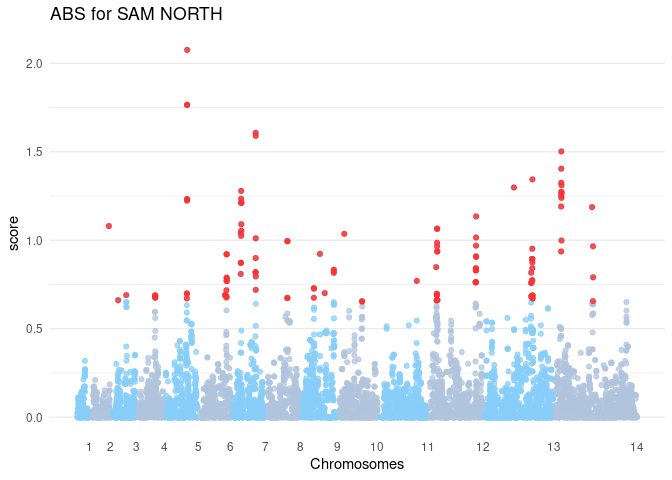
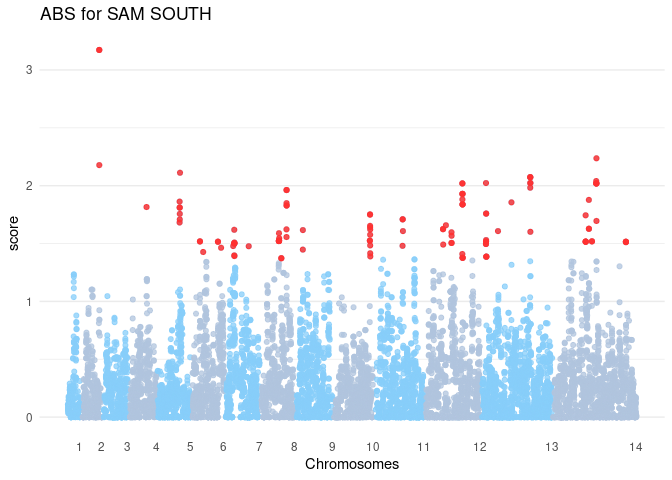

Selection scan
================
Margaux Lefebvre
2022-10-12

This repository is for this paper: (citation)

All the data are available here:

The languages used are mainly bash and R.

# *Rsb* and *XP-EHH*

As we have only mono-clonal infection samples, we do not need to phase
the samples (haploid stage of *P. falciparumm* life cycle). To not lose
too much SNPs, we did not polarize.

``` r
library(vcfR)
library(rehh)

REGION<-c("NORTH","SOUTH","Senegal")
chr <- c("01","02","03","04","05","06","07","08","09","10","11","12","13","14")
for (pop in REGION){
for (i in chr){
  file <- paste0("./Data/temp_",i,"_",pop,".vcf.gz")
  hh <- data2haplohh(hap_file = file, polarize_vcf = FALSE, vcf_reader = "vcfR", allele_coding = "01") # read the data
  scan <- scan_hh(hh, phased = T, polarized = F) # scan the chromosome
  id <- paste0("scan_",i)
  assign(id, scan)
}
scan_total <- rbind(scan_01, scan_02, scan_03, scan_04, scan_05, scan_06, scan_07,scan_08, scan_09, scan_10, scan_11, scan_12, scan_13, scan_14) # Gather all the chromosomes
path<-paste0("./Data/scan_",pop,".txt")
write_tsv(scan_total, path)
}
```

## *Rsb*

The p-value is 4 as this is advised in the [rehh
vignette](https://cran.r-project.org/web/packages/rehh/vignettes/rehh.html),
and it corrects for multiple tests.

``` r
library(vcfR)
library(rehh)

# Read data
AM <- c("NORTH", "SOUTH")
  scan_Senegal <- read_delim("./Data/scan_Senegal.txt", "\t", escape_double = FALSE, trim_ws = TRUE)
  for (j in AM) {
    path_SAM<-paste0("./Data/scan_",j,".txt")
    scan_SAM <- read_delim(path_SAM, "\t", escape_double = FALSE, trim_ws = TRUE)
    
    rsb.Senegal_SAM <- ines2rsb(scan_pop1 =  scan_Senegal,
                                 scan_pop2 =  scan_SAM,
                                 popname1 = "Senegal",
                                 popname2 = "SAM")
    
    rsb.Senegal_SAM<-na.omit(rsb.Senegal_SAM)
    # make an outlier column in the data.frame (only SNPs that present a mark of selection in SAM : negative RSb value + significant p-value)
    for (i in 1:length(rsb.Senegal_SAM$LOGPVALUE)) {
      if ((rsb.Senegal_SAM$LOGPVALUE[i] > 4) && (rsb.Senegal_SAM$RSB_Senegal_SAM[i]<0)) {rsb.Senegal_SAM$STATUT[i] <- "outlier"}  else {rsb.Senegal_SAM$STATUT[i] <- "background"}
    }
    
    highlight<-subset(rsb.Senegal_SAM, rsb.Senegal_SAM$STATUT=="outlier")
    rsb.Senegal_SAM$CHR<-as.numeric(as.factor(rsb.Senegal_SAM$CHR))
    name_data<-paste0("Senegal_",j)
    assign(name_data, rsb.Senegal_SAM)
    
 #Plot
    rsb.Senegal_SAM$CHR<-as.numeric(as.factor(rsb.Senegal_SAM$CHR))
  data_cum <-  rsb.Senegal_SAM %>% 
    group_by(CHR) %>% 
    summarise(max_bp = max(POSITION)) %>% 
    mutate(bp_add = lag(cumsum(max_bp), default = 0)) %>% 
    select(CHR, bp_add)
   rsb.Senegal_SAM <-  rsb.Senegal_SAM %>% 
    inner_join(data_cum, by = "CHR") %>% 
    mutate(bp_cum = POSITION + bp_add)
  
  axis_set <-  rsb.Senegal_SAM %>% 
    group_by(CHR) %>% 
    summarize(center = max(bp_cum))
  
  highlight<-subset( rsb.Senegal_SAM,  rsb.Senegal_SAM$STATUT=="outlier")
  
  p1<-ggplot(rsb.Senegal_SAM, aes(x = bp_cum, y =LOGPVALUE,color = as_factor(CHR))) +
    geom_point(alpha = 0.75) +
    geom_hline(yintercept = 4, color = "grey40", linetype = "dashed") + 
    scale_x_continuous(label = axis_set$CHR, breaks = axis_set$center) +
    scale_color_manual(values = rep(c("lightskyblue", "lightsteelblue"), unique(length(axis_set$CHR))))+
    labs(x = "Chromosome", y = "-log(p-value)") + 
    theme_minimal() +
    theme( 
      legend.position = "none",
      panel.border = element_blank(),
      panel.grid.major.x = element_blank(),
      panel.grid.minor.x = element_blank(),
      axis.text.x = element_text())
  title<-paste0("Rsb : Senegal VS ", j)
  p2<-p1+geom_point(data=highlight, aes(x = bp_cum, y =LOGPVALUE), color = "firebrick1", alpha= 0.8)+ggtitle(title)
  name_plot<-paste0("plot_rsb_",j)
  assign(name_plot, p2)
  }
```

    ## Scan of pop1 contains 77133 markers.
    ## Scan of pop2 contains 53928 markers.
    ## Merged data contains 53538 markers.
    ## Scan of pop1 contains 77133 markers.
    ## Scan of pop2 contains 68683 markers.
    ## Merged data contains 68145 markers.

``` r
  plot_rsb_NORTH
```

<!-- -->

``` r
  plot_rsb_SOUTH
```

<!-- -->

## *XP-EHH*

The p-value is 4 as this is advised in the [rehh
vignette](https://cran.r-project.org/web/packages/rehh/vignettes/rehh.html),
and it corrects for multiple tests.

``` r
library(vcfR)
library(rehh)

# Read data
AM <- c("NORTH", "SOUTH")
  scan_Senegal <- read_delim("./Data/scan_Senegal.txt", "\t", escape_double = FALSE, trim_ws = TRUE)
  for (j in AM) {
    path_SAM<-paste0("./Data/scan_",j,".txt")
    scan_SAM <- read_delim(path_SAM, "\t", escape_double = FALSE, trim_ws = TRUE)
    
    xpehh.Senegal_SAM <- ies2xpehh(scan_pop1 =  scan_Senegal,
                                 scan_pop2 =  scan_SAM,
                                 popname1 = "Senegal",
                                 popname2 = "SAM")
    
    xpehh.Senegal_SAM<-na.omit(xpehh.Senegal_SAM)
# make an outlier column in the data.frame (only SNPs that present a mark of selection in SAM : negative XP-EHH value + significant p-value)
    for (i in 1:length(xpehh.Senegal_SAM$LOGPVALUE)) {
      if ((xpehh.Senegal_SAM$LOGPVALUE[i] > 4) && (xpehh.Senegal_SAM$XPEHH_Senegal_SAM[i]<0)) {xpehh.Senegal_SAM$STATUT[i] <- "outlier"}  else {xpehh.Senegal_SAM$STATUT[i] <- "background"}
    }
    xpehh.Senegal_SAM$candidate<-"no"
    for (i in 1:nrow(xpehh.Senegal_SAM)){
      if ((xpehh.Senegal_SAM$LOGPVALUE[i]>xpehh.Senegal_SAM$LOGPVALUE[i-1]) && (xpehh.Senegal_SAM$LOGPVALUE[i]>xpehh.Senegal_SAM$LOGPVALUE[i+1]) && (xpehh.Senegal_SAM$STATUT[i] == "outlier")) {xpehh.Senegal_SAM$candidate[i] <- "yes"
      xpehh.Senegal_SAM$candidate[i+1]<-"next"
      xpehh.Senegal_SAM$candidate[i-1]<-"next"}
    } 
    candidate<-subset(xpehh.Senegal_SAM, xpehh.Senegal_SAM$candidate!="no")
    
    highlight<-subset(xpehh.Senegal_SAM, xpehh.Senegal_SAM$STATUT=="outlier")
    xpehh.Senegal_SAM$CHR<-as.numeric(as.factor(xpehh.Senegal_SAM$CHR))
    name_data<-paste0("Senegal_",j)
    assign(name_data, xpehh.Senegal_SAM)
    
 #Plot
    xpehh.Senegal_SAM$CHR<-as.numeric(as.factor(xpehh.Senegal_SAM$CHR))
  data_cum <-  xpehh.Senegal_SAM %>% 
    group_by(CHR) %>% 
    summarise(max_bp = max(POSITION)) %>% 
    mutate(bp_add = lag(cumsum(max_bp), default = 0)) %>% 
    select(CHR, bp_add)
   xpehh.Senegal_SAM <-  xpehh.Senegal_SAM %>% 
    inner_join(data_cum, by = "CHR") %>% 
    mutate(bp_cum = POSITION + bp_add)
  
  axis_set <-  xpehh.Senegal_SAM %>% 
    group_by(CHR) %>% 
    summarize(center = max(bp_cum))
  
  highlight<-subset(xpehh.Senegal_SAM, xpehh.Senegal_SAM$STATUT=="outlier")
  
  p1<-ggplot(xpehh.Senegal_SAM, aes(x = bp_cum, y =LOGPVALUE,color = as_factor(CHR))) +
    geom_point(alpha = 0.75) +
    geom_hline(yintercept = 4, color = "grey40", linetype = "dashed") + 
    scale_x_continuous(label = axis_set$CHR, breaks = axis_set$center) +
    scale_color_manual(values = rep(c("lightskyblue", "lightsteelblue"), unique(length(axis_set$CHR))))+
    labs(x = "Chromosome", y = "-log(p-value)") + 
    theme_minimal() +
    theme( 
      legend.position = "none",
      panel.border = element_blank(),
      panel.grid.major.x = element_blank(),
      panel.grid.minor.x = element_blank(),
      axis.text.x = element_text())
  title<-paste0("XP-EHH : Senegal VS ", j)
  p2<-p1+geom_point(data=highlight, aes(x = bp_cum, y =LOGPVALUE), color = "firebrick1", alpha= 0.8)+ggtitle(title)
  name_plot<-paste0("plot_XPEHH_",j)
  assign(name_plot, p2)
  }
```

    ## Scan of pop1 contains 77133 markers.
    ## Scan of pop2 contains 53928 markers.
    ## Merged data contains 53538 markers.
    ## Scan of pop1 contains 77133 markers.
    ## Scan of pop2 contains 68683 markers.
    ## Merged data contains 68145 markers.

``` r
  plot_XPEHH_NORTH
```

<!-- -->

``` r
  plot_XPEHH_SOUTH
```

<!-- -->

# ABS

To calculate ABS, we used the software *CalcABS*, with the documentation
[here](http://degiorgiogroup.fau.edu/CalcABS_manual.pdf). The input is a
little particular, so we made a home made R script:
[vcftools2CalcABS.R](./vcftools2CalcABS.R).

``` bash
ARR_CHR=(01 02 03 04 05 06 07 08 09 10 11 12 13 14)
REGION=(French_Guiana Brazil Colombia Haiti Senegal Myanmar)

for CHR in ${ARR_CHR[@]}
do
for R in ${REGION[@]}
do
# Count the alleles for each population, for each chromosome
  vcftools --gzvcf all_genome_samples_filter.vcf.gz \
--keep country_filtered/${R}.txt --chr Pf3D7_${CHR}_v3 \
  --counts2 --out Chr_${CHR}_${R} &
  wait
done
# Transform vcftools output to CalcABS input
### SAM South
Rscript vcftools2CalcABS.R Chr_${CHR}_French_Guiana.frq.count Chr_${CHR}_Brazil.frq.count Chr_${CHR}_Senegal.frq.count Chr_${CHR}_Myanmar.frq.count input_South_${CHR}.txt
### SAM North
Rscript vcftools2CalcABS.R Chr_${CHR}_Haiti.frq.count Chr_${CHR}_Colombia.frq.count Chr_${CHR}_Senegal.frq.count Chr_${CHR}_Myanmar.frq.count input_North_${CHR}.txt
done
```

**Running CalcABS:**

``` bash
ARR_CHR=(01 02 03 04 05 06 07 08 09 10 11 12 13 14)

REGION=(North South)
for out in ${REGION[@]}
do
  cd CalcABS/
for CHR in ${ARR_CHR[@]}
do
  python CalcABS.py -i input_${out}_${CHR}.txt -o ABS_${CHR}_${out}.txt -n 1,2,3 -w 20000 -s 1000 --fix 12
  # window of 20 kb with a step of 1 kb
  # population 1 and 2 are fixed as the sister populations
done
done

# Make a final file with all the chromosomes
### Take the header from the first file
grep "^chr" ABS_01_North.txt > ABS_NORTH_final.txt
grep "^chr" ABS_01_South.txt > ABS_SOUTH_final.txt
### Take the data for all the chromosomes
for CHR in ${ARR_CHR[@]}
do
  grep -v "^chr" ABS_${CHR}_North.txt >> ABS_NORTH_final.txt
  grep -v "^chr" ABS_${CHR}_South.txt >> ABS_SOUTH_final.txt
done
```

**Plots:**

``` r
### NORTH
ABS_NORTH <- read_delim(paste0("./Data/ABS_NORTH_final.txt"), delim = "\t", escape_double = FALSE, trim_ws = TRUE, show_col_types = FALSE)

ABS_NORTH<-na.omit(ABS_NORTH)
for (i in 1:nrow(ABS_NORTH)) {
  if (ABS_NORTH$score[i] < 0) {ABS_NORTH$score[i] <- 0}
}
ABS_NORTH<-subset(ABS_NORTH, ABS_NORTH$numSites>=20)
# significance level
my_threshold <- quantile(ABS_NORTH$score, 0.99)
# make an outlier column in the data.frame
for (i in 1:nrow(ABS_NORTH)) {
  if (ABS_NORTH$score[i] > my_threshold) {ABS_NORTH$state[i] <- "outlier"}  else {ABS_NORTH$state[i] <- "background"}
}

ABS_NORTH_MAX<-subset(ABS_NORTH, ABS_NORTH$state=="outlier")

# Detecting the peak
ABS_NORTH_MAX$PLUS_1<-0
for (i in 1:(nrow(ABS_NORTH_MAX)-1)){
  if (ABS_NORTH_MAX$chr[i]==ABS_NORTH_MAX$chr[i+1]) {ABS_NORTH_MAX$PLUS_1[i]<-ABS_NORTH_MAX$midPos[i+1]-ABS_NORTH_MAX$midPos[i]}
}
ABS_NORTH_MAX$PLUS_2<-0
for (i in 1:(nrow(ABS_NORTH_MAX)-2)){
  if (ABS_NORTH_MAX$chr[i]==ABS_NORTH_MAX$chr[i+2]) {ABS_NORTH_MAX$PLUS_2[i]<-ABS_NORTH_MAX$midPos[i+2]-ABS_NORTH_MAX$midPos[i]}
}
ABS_NORTH_MAX$MOINS_1<-0
for (i in 2:(nrow(ABS_NORTH_MAX))){
  if (ABS_NORTH_MAX$chr[i]==ABS_NORTH_MAX$chr[i-1]) {ABS_NORTH_MAX$MOINS_1[i]<-ABS_NORTH_MAX$midPos[i-1]-ABS_NORTH_MAX$midPos[i]}
}
ABS_NORTH_MAX$MOINS_2<-0
for (i in 3:(nrow(ABS_NORTH_MAX))){
  if (ABS_NORTH_MAX$chr[i]==ABS_NORTH_MAX$chr[i-2]) {ABS_NORTH_MAX$MOINS_2[i]<-ABS_NORTH_MAX$midPos[i-2]-ABS_NORTH_MAX$midPos[i]}
}

# Create a number ID by peak
ABS_NORTH_MAX$peak<-NA
p <- 1 # initialization
for (i in 1:(nrow(ABS_NORTH_MAX))){
  if ((ABS_NORTH_MAX$PLUS_1[i]==10000) && (ABS_NORTH_MAX$PLUS_2[i]==20000)) {ABS_NORTH_MAX$peak[i]<-p} #start of the peak
  else if ((ABS_NORTH_MAX$PLUS_1[i]==10000) && (ABS_NORTH_MAX$MOINS_1[i]==-10000)) {ABS_NORTH_MAX$peak[i]<-p} #middle of the peak
  else if ((ABS_NORTH_MAX$MOINS_1[i]==-10000) && (ABS_NORTH_MAX$MOINS_2[i]==-20000)) {ABS_NORTH_MAX$peak[i]<-p} #end of the peak
  else {p <- p+1}
}

ABS_NORTH_peak<-na.omit(ABS_NORTH_MAX) # remove all the region not in peak
ABS_NORTH_peak$peak<-as.numeric(as.factor(ABS_NORTH_peak$peak)) # a more elegant way to call the peak

#keep the maximum values by peak
ABS_peak <-ABS_NORTH_peak %>% group_by(peak) %>% slice_max(n=1,order_by=score)

#adding the regions that are not peak + keeping the max of each peak
ABS_not.peak<-subset(ABS_NORTH_MAX, is.na(ABS_NORTH_MAX$peak))
ABS_selection_NORTH<-rbind(ABS_peak,ABS_not.peak)

# Plot
ABS_NORTH$chr<-as.numeric(as.factor(ABS_NORTH$chr))

data_cum <- ABS_NORTH %>% 
  group_by(chr) %>% 
  summarise(max_bp = max(midPos)) %>% 
  mutate(bp_add = lag(cumsum(max_bp), default = 0)) %>% 
  select(chr, bp_add)
ABS_NORTH <- ABS_NORTH%>% 
  inner_join(data_cum, by = "chr") %>% 
  mutate(bp_cum = midPos + bp_add)

axis_set <- ABS_NORTH %>% 
  group_by(chr) %>% 
  summarize(center = max(bp_cum))

ABS_selection_NORTH$chr<-as.numeric(as.factor(ABS_selection_NORTH$chr))
ABS_selection<-inner_join(ABS_selection_NORTH, ABS_NORTH, by = c("score","midPos"))


p1<-ggplot(ABS_NORTH, aes(x = bp_cum, y =score,color = as_factor(chr))) +
  geom_point(alpha = 0.75) +
  scale_x_continuous(label = axis_set$chr, breaks = axis_set$center) +
  scale_color_manual(values = rep(c("lightskyblue", "lightsteelblue"), unique(length(axis_set$chr))))+
  labs(x = "Chromosomes", y = "score") + 
  theme_minimal() +
  theme( 
    legend.position = "none",
    panel.border = element_blank(),
    panel.grid.major.x = element_blank(),
    panel.grid.minor.x = element_blank(),
    axis.text.x = element_text())
title<-paste0("ABS for SAM NORTH")
p1+geom_point(data=ABS_selection, aes(x = bp_cum, y =score), color = "firebrick1", alpha= 0.8)+ggtitle(title)
```

<!-- -->

``` r
### SOUTH
ABS_SOUTH <- read_delim(paste0("./Data/ABS_SOUTH_final.txt"), delim = "\t", escape_double = FALSE, trim_ws = TRUE, show_col_types = FALSE)

ABS_SOUTH<-na.omit(ABS_SOUTH)
for (i in 1:nrow(ABS_SOUTH)) {
  if (ABS_SOUTH$score[i] < 0) {ABS_SOUTH$score[i] <- 0}
}
ABS_SOUTH<-subset(ABS_SOUTH, ABS_SOUTH$numSites>=20)
# significance level
my_threshold <- quantile(ABS_SOUTH$score, 0.99)
# make an outlier column in the data.frame
for (i in 1:nrow(ABS_SOUTH)) {
  if (ABS_SOUTH$score[i] > my_threshold) {ABS_SOUTH$state[i] <- "outlier"}  else {ABS_SOUTH$state[i] <- "background"}
}

ABS_SOUTH_MAX<-subset(ABS_SOUTH, ABS_SOUTH$state=="outlier")

# Detecting the peak
ABS_SOUTH_MAX$PLUS_1<-0
for (i in 1:(nrow(ABS_SOUTH_MAX)-1)){
  if (ABS_SOUTH_MAX$chr[i]==ABS_SOUTH_MAX$chr[i+1]) {ABS_SOUTH_MAX$PLUS_1[i]<-ABS_SOUTH_MAX$midPos[i+1]-ABS_SOUTH_MAX$midPos[i]}
}
ABS_SOUTH_MAX$PLUS_2<-0
for (i in 1:(nrow(ABS_SOUTH_MAX)-2)){
  if (ABS_SOUTH_MAX$chr[i]==ABS_SOUTH_MAX$chr[i+2]) {ABS_SOUTH_MAX$PLUS_2[i]<-ABS_SOUTH_MAX$midPos[i+2]-ABS_SOUTH_MAX$midPos[i]}
}
ABS_SOUTH_MAX$MOINS_1<-0
for (i in 2:(nrow(ABS_SOUTH_MAX))){
  if (ABS_SOUTH_MAX$chr[i]==ABS_SOUTH_MAX$chr[i-1]) {ABS_SOUTH_MAX$MOINS_1[i]<-ABS_SOUTH_MAX$midPos[i-1]-ABS_SOUTH_MAX$midPos[i]}
}
ABS_SOUTH_MAX$MOINS_2<-0
for (i in 3:(nrow(ABS_SOUTH_MAX))){
  if (ABS_SOUTH_MAX$chr[i]==ABS_SOUTH_MAX$chr[i-2]) {ABS_SOUTH_MAX$MOINS_2[i]<-ABS_SOUTH_MAX$midPos[i-2]-ABS_SOUTH_MAX$midPos[i]}
}

# Create a number ID by peak
ABS_SOUTH_MAX$peak<-NA
p <- 1 # initialization
for (i in 1:(nrow(ABS_SOUTH_MAX))){
  if ((ABS_SOUTH_MAX$PLUS_1[i]==10000) && (ABS_SOUTH_MAX$PLUS_2[i]==20000)) {ABS_SOUTH_MAX$peak[i]<-p} #start of the peak
  else if ((ABS_SOUTH_MAX$PLUS_1[i]==10000) && (ABS_SOUTH_MAX$MOINS_1[i]==-10000)) {ABS_SOUTH_MAX$peak[i]<-p} #middle of the peak
  else if ((ABS_SOUTH_MAX$MOINS_1[i]==-10000) && (ABS_SOUTH_MAX$MOINS_2[i]==-20000)) {ABS_SOUTH_MAX$peak[i]<-p} #end of the peak
  else {p <- p+1}
}

ABS_SOUTH_peak<-na.omit(ABS_SOUTH_MAX) # remove all the region not in peak
ABS_SOUTH_peak$peak<-as.numeric(as.factor(ABS_SOUTH_peak$peak)) # a more elegant way to call the peak

#keep the maximum values by peak
ABS_peak <-ABS_SOUTH_peak %>% group_by(peak) %>% slice_max(n=1,order_by=score)

#adding the regions that are not peak + keeping the max of each peak
ABS_not.peak<-subset(ABS_SOUTH_MAX, is.na(ABS_SOUTH_MAX$peak))
ABS_selection_SOUTH<-rbind(ABS_peak,ABS_not.peak)

# Plot
ABS_SOUTH$chr<-as.numeric(as.factor(ABS_SOUTH$chr))

data_cum <- ABS_SOUTH %>% 
  group_by(chr) %>% 
  summarise(max_bp = max(midPos)) %>% 
  mutate(bp_add = lag(cumsum(max_bp), default = 0)) %>% 
  select(chr, bp_add)
ABS_SOUTH <- ABS_SOUTH%>% 
  inner_join(data_cum, by = "chr") %>% 
  mutate(bp_cum = midPos + bp_add)

axis_set <- ABS_SOUTH %>% 
  group_by(chr) %>% 
  summarize(center = max(bp_cum))

ABS_selection_SOUTH$chr<-as.numeric(as.factor(ABS_selection_SOUTH$chr))
ABS_selection<-inner_join(ABS_selection_SOUTH, ABS_SOUTH, by = c("score","midPos"))


p1<-ggplot(ABS_SOUTH, aes(x = bp_cum, y =score,color = as_factor(chr))) +
  geom_point(alpha = 0.75) +
  scale_x_continuous(label = axis_set$chr, breaks = axis_set$center) +
  scale_color_manual(values = rep(c("lightskyblue", "lightsteelblue"), unique(length(axis_set$chr))))+
  labs(x = "Chromosomes", y = "score") + 
  theme_minimal() +
  theme( 
    legend.position = "none",
    panel.border = element_blank(),
    panel.grid.major.x = element_blank(),
    panel.grid.minor.x = element_blank(),
    axis.text.x = element_text())
title<-paste0("ABS for SAM SOUTH")
p1+geom_point(data=ABS_selection, aes(x = bp_cum, y =score), color = "firebrick1", alpha= 0.8)+ggtitle(title)
```

<!-- -->

# Software and version

-   vcftools 0.1.16
-   Python 3.9.5 (for CalcABS)

**R session info and packages:**

    ## R version 4.2.1 (2022-06-23)
    ## Platform: x86_64-pc-linux-gnu (64-bit)
    ## Running under: Ubuntu 22.04.1 LTS
    ## 
    ## Matrix products: default
    ## BLAS:   /usr/lib/x86_64-linux-gnu/blas/libblas.so.3.10.0
    ## LAPACK: /usr/lib/x86_64-linux-gnu/lapack/liblapack.so.3.10.0
    ## 
    ## locale:
    ##  [1] LC_CTYPE=fr_FR.UTF-8       LC_NUMERIC=C              
    ##  [3] LC_TIME=fr_FR.UTF-8        LC_COLLATE=fr_FR.UTF-8    
    ##  [5] LC_MONETARY=fr_FR.UTF-8    LC_MESSAGES=fr_FR.UTF-8   
    ##  [7] LC_PAPER=fr_FR.UTF-8       LC_NAME=C                 
    ##  [9] LC_ADDRESS=C               LC_TELEPHONE=C            
    ## [11] LC_MEASUREMENT=fr_FR.UTF-8 LC_IDENTIFICATION=C       
    ## 
    ## attached base packages:
    ## [1] stats     graphics  grDevices utils     datasets  methods   base     
    ## 
    ## other attached packages:
    ##  [1] rehh_3.2.2      vcfR_1.13.0     forcats_0.5.2   stringr_1.4.1  
    ##  [5] dplyr_1.0.9     purrr_0.3.4     readr_2.1.2     tidyr_1.2.0    
    ##  [9] tibble_3.1.8    ggplot2_3.3.6   tidyverse_1.3.2
    ## 
    ## loaded via a namespace (and not attached):
    ##  [1] httr_1.4.4          bit64_4.0.5         vroom_1.5.7        
    ##  [4] jsonlite_1.8.0      viridisLite_0.4.1   splines_4.2.1      
    ##  [7] modelr_0.1.9        assertthat_0.2.1    highr_0.9          
    ## [10] googlesheets4_1.0.1 cellranger_1.1.0    yaml_2.3.5         
    ## [13] pillar_1.8.1        backports_1.4.1     lattice_0.20-45    
    ## [16] glue_1.6.2          digest_0.6.29       rvest_1.0.3        
    ## [19] colorspace_2.0-3    htmltools_0.5.3     Matrix_1.4-1       
    ## [22] pkgconfig_2.0.3     broom_1.0.1         haven_2.5.1        
    ## [25] scales_1.2.1        tzdb_0.3.0          googledrive_2.0.0  
    ## [28] mgcv_1.8-40         farver_2.1.1        generics_0.1.3     
    ## [31] ellipsis_0.3.2      withr_2.5.0         cli_3.3.0          
    ## [34] magrittr_2.0.3      crayon_1.5.1        readxl_1.4.1       
    ## [37] evaluate_0.16       fs_1.5.2            fansi_1.0.3        
    ## [40] nlme_3.1-159        MASS_7.3-58.1       xml2_1.3.3         
    ## [43] vegan_2.6-2         tools_4.2.1         hms_1.1.2          
    ## [46] gargle_1.2.0        lifecycle_1.0.1     munsell_0.5.0      
    ## [49] reprex_2.0.2        cluster_2.1.4       compiler_4.2.1     
    ## [52] rlang_1.0.4         grid_4.2.1          rstudioapi_0.14    
    ## [55] labeling_0.4.2      rmarkdown_2.16      gtable_0.3.0       
    ## [58] DBI_1.1.3           R6_2.5.1            rehh.data_1.0.0    
    ## [61] lubridate_1.8.0     knitr_1.40          pinfsc50_1.2.0     
    ## [64] bit_4.0.4           fastmap_1.1.0       utf8_1.2.2         
    ## [67] permute_0.9-7       ape_5.6-2           stringi_1.7.8      
    ## [70] parallel_4.2.1      Rcpp_1.0.9          vctrs_0.4.1        
    ## [73] dbplyr_2.2.1        tidyselect_1.1.2    xfun_0.32
